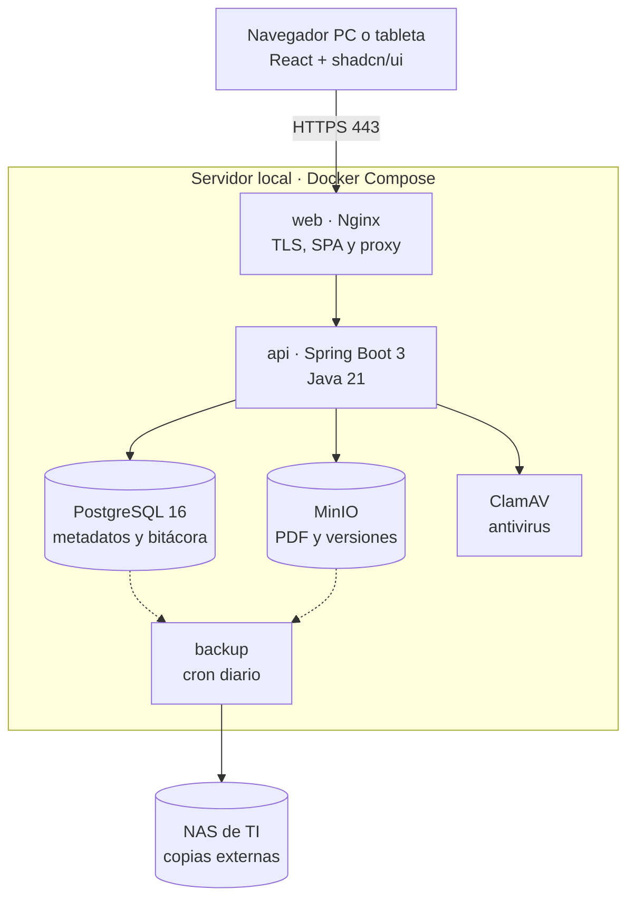
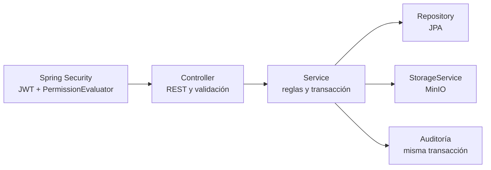
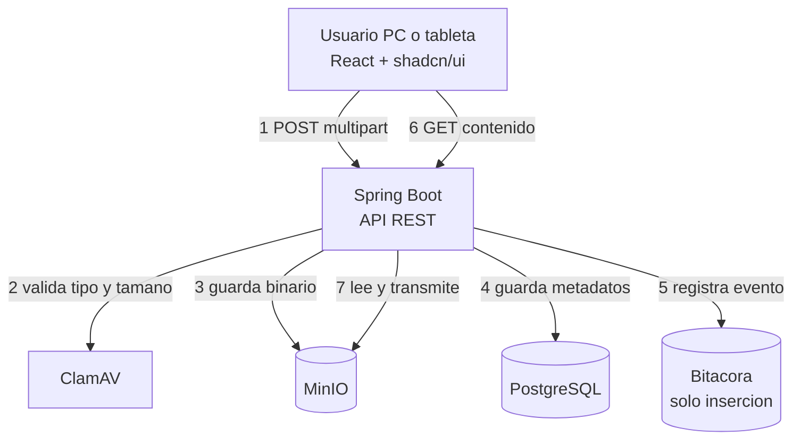

## Índice

0. [Ficha del proyecto](#0-ficha-del-proyecto)
1. [Descripción general del producto](#1-descripción-general-del-producto)
2. [Arquitectura del sistema](#2-arquitectura-del-sistema)
3. [Modelo de datos](#3-modelo-de-datos)
4. [Especificación de la API](#4-especificación-de-la-api)
5. [Historias de usuario](#5-historias-de-usuario)
6. [Tickets de trabajo](#6-tickets-de-trabajo)
7. [Pull requests](#7-pull-requests)

---

## 0. Ficha del proyecto

### **0.1. Tu nombre completo:**
- Diego Javier Ruiz Vintimilla

### **0.2. Nombre del proyecto:**
- Gestion Documental

### **0.3. Descripción breve del proyecto:**
Es una aplicación web para organizar los expedientes documentales de la institución, que hoy están en carpetas compartidas sin estructura común, sin control de acceso por documento y sin registro de cambios.

El administrador define todo el modelo sin programar:

Los roles de sujeto, como socio, cliente o proveedor.
Una jerarquía de clasificaciones de hasta 6 niveles, por ejemplo Socio → Crédito → Garantía.
Las etiquetas documentales de cada clasificación, obligatorias u opcionales.

Los usuarios crean sujetos y operaciones con un código único que nunca se reutiliza. Cargan un PDF por etiqueta, y cada reemplazo guarda una versión nueva sin perder la anterior.

Si a una operación o a sus descendientes le falta un documento obligatorio, la aplicación la marca como Incompleta. Si no se regulariza dentro del plazo parametrizable (10 días al inicio), la resalta en rojo como Vencida.

El acceso se controla con roles de permisos granulares por tipo de clasificación y por etiqueta: ver, descargar, cargar, reemplazar o dar de baja. Una bitácora inmutable registra cada cambio, cada visualización y cada descarga. Los documentos se conservan 10 años desde su primera carga; después, solo el administrador puede purgarlos.

### **0.4. URL del proyecto:**

> Puede ser pública o privada, en cuyo caso deberás compartir los accesos de manera segura. Puedes enviarlos a [alvaro@lidr.co](mailto:alvaro@lidr.co) usando algún servicio como [onetimesecret](https://onetimesecret.com/).

https://github.com/diegojavinti2183/GestionDocumental.git

### **0.5. URL o archivo comprimido del repositorio:**

> Puedes tenerlo alojado en público o en privado, en cuyo caso deberás compartir los accesos de manera segura. Puedes enviarlos a [alvaro@lidr.co](mailto:alvaro@lidr.co) usando algún servicio como [onetimesecret](https://onetimesecret.com/). También puedes compartir por correo un archivo zip con el contenido


---

## 1. Descripción general del producto

> Describe en detalle los siguientes aspectos del producto:

### **1.1. Objetivo:**

> Propósito del producto. Qué valor aporta, qué soluciona, y para quién.

#### Propósito del producto

El producto convierte la documentación de respaldo de cada operación en un expediente digital estructurado, controlado y trazable. Cada crédito, inversión o contrato tiene un lugar definido para cada documento, y cualquier persona autorizada lo encuentra en segundos.

El principio central es que la estructura del expediente es un dato configurable, no código. Cuando la institución crea un producto nuevo, el administrador define en minutos su rol de sujeto, su jerarquía de clasificaciones y sus etiquetas documentales, sin pedir desarrollo a TI.

#### Qué soluciona

Hoy los documentos viven en carpetas de red nombradas a criterio de cada analista. Eso produce seis problemas concretos:

|Problema actual |Cómo lo resuelve el producto|
|---|---|
|Estructura inconsistente: dos créditos iguales no tienen los mismos documentos ni con los mismos nombres |Cada tipo de clasificación tiene una plantilla de etiquetas; toda operación nueva nace con la misma estructura|
|No se sabe qué falta: revisar la completitud exige abrir carpeta por carpeta |La operación se marca sola como Incompleta, con el número de etiquetas pendientes, y como Vencida si supera el plazo de regularización|
|Acceso de todo o nada: quien entra a la carpeta ve todos los expedientes |Permisos granulares por tipo de clasificación y por etiqueta: un auditor puede ver documentos sin descargarlos ni modificarlos|
|Sin trazabilidad: nadie sabe quién reemplazó o borró un archivo |Bitácora inmutable de cada carga, reemplazo, baja, visualización y descarga, con usuario, fecha e IP|
|Pérdida de versiones: un archivo reemplazado desaparece |Versionado automático: cada reemplazo conserva la versión anterior|
|Búsqueda lenta y borrados sin control |Búsqueda por código, sujeto o archivo; eliminación siempre lógica, retención de 10 años y purga solo por el administrador|

#### Qué valor aporta
- Cumplimiento y auditoría. Demuestra quién hizo qué y cuándo, conserva los documentos durante el plazo legal y reduce hallazgos por expedientes incompletos. La meta propuesta en el PRD es que al menos el 95 % de las operaciones tenga completos sus documentos obligatorios.
- Eficiencia operativa. Localizar un documento pasa de recorrer carpetas a unos 15 segundos. Los oficiales dejan de crear estructuras a mano, y los supervisores trabajan desde una bandeja de operaciones incompletas ordenada por vencimiento.
- Agilidad del negocio. Un producto o línea de negocio nuevo se modela en unos 10 minutos, en lugar de días de trabajo de TI.
- Seguridad de la información. Cédulas, pagarés y pólizas quedan protegidos por permisos precisos, con cada lectura registrada. Los documentos se guardan en servidores propios, con respaldo diario en el NAS de TI.
- Continuidad y control. Nada se pierde por error: la baja es reversible hasta cumplir la retención, y las versiones anteriores siguen disponibles.

#### Para quién
|Usuario |Qué hace con el producto |Qué gana|
|---|---|---|
|Oficial de negocio / analista |Crea sujetos y operaciones, carga y reemplaza PDFs desde PC o tableta |Estructura lista de antemano, sabe exactamente qué documento falta y corrige errores del día|
|Supervisor de área |Revisa la completitud y gestiona la regularización |Bandeja de incompletas y vencidas, en lugar de revisar carpeta por carpeta|
|Auditor / cumplimiento |Consulta expedientes y bitácora según su rol |Evidencia confiable e inalterable, sin riesgo de modificar nada|
|Administrador del sistema |Configura el modelo, los roles, los permisos y los parámetros, gestiona Docker y ejecuta las purgas |Adapta la herramienta a la institución sin depender de desarrollo|
|La institución |Gestiona su archivo documental en toda la organización |Menor riesgo regulatorio, datos protegidos y procesos más rápidos|

El producto está pensado para instituciones que gestionan operaciones con respaldo documental obligatorio, por ejemplo cooperativas de ahorro y crédito o entidades financieras. Los sujetos son socios, clientes o proveedores, y cada operación exige un conjunto conocido de documentos que debe estar completo y protegido.


### **1.2. Características y funcionalidades principales:**

> Enumera y describe las características y funcionalidades específicas que tiene el producto para satisfacer las necesidades identificadas.

#### 1. Configuración del modelo documental
Cubre la necesidad de estandarizar los expedientes y de adaptarse a productos nuevos sin desarrollo.

1. Roles de sujeto. El administrador crea los roles que maneja la institución (socio, cliente, proveedor) y define para cada uno el patrón y la longitud máxima de su código.
2. Tipos de clasificación. Se definen las clases de operación o de elemento del expediente: crédito, inversión, garantía, contrato.
3. Reglas de jerarquía de hasta 6 niveles. Indican qué tipo puede colgar de qué padre y con qué cardinalidad; por ejemplo, un socio tiene de 0 a n créditos y un crédito de 0 a n garantías. El sistema impide ciclos y niveles de más.
4. Plantillas de etiquetas documentales. Cada tipo de clasificación tiene sus etiquetas, con nombre, orden, obligatoriedad y tamaño máximo de archivo propio. Las etiquetas no se anidan.
5. Vista previa del árbol de tipos. Antes de guardar, el administrador ve cómo quedará la jerarquía, y la pantalla le advierte cuántas operaciones cambiarán de estado si agrega una etiqueta obligatoria.
#### 2. Gestión de sujetos y operaciones
Cubre la necesidad de dar una identidad única y un orden a cada expediente.

6. Alta de sujetos por rol. Cada rol que adopta una persona es un registro independiente, con su código único dentro del rol y un nombre visible.
7. Clasificaciones en cualquier nivel. El usuario crea una operación bajo un sujeto o bajo otra clasificación. Solo se le ofrecen los tipos que permiten las reglas, y al crearla aparecen automáticamente sus etiquetas vacías.
8. Códigos únicos y perpetuos. El código de una clasificación es único en toda la institución y nunca se reutiliza, ni siquiera después de su baja.
9. Baja lógica en cascada. Dar de baja un sujeto o una operación exige motivo y alcanza a todos sus descendientes; la confirmación muestra cuántos nodos y documentos se verán afectados. Los nodos nunca se mueven de lugar.
#### 3. Gestión documental
Cubre la necesidad de guardar los respaldos sin perderlos ni duplicarlos.

10. Carga de PDF por etiqueta. Se puede arrastrar el archivo en PC o elegirlo con un botón en tableta, cargar hasta 20 archivos a la vez y ver una barra de progreso con reintento.
11. Validación del archivo. El sistema comprueba que sea un PDF real (no solo por la extensión), rechaza los PDF cifrados y los que superan el tamaño permitido, y los analiza con antivirus.
12. Versionado automático. Reemplazar un documento crea una versión nueva y conserva la anterior, con su autor, fecha, hash y motivo.
13. Visor integrado. El PDF se lee dentro de la aplicación, en PC o tableta, sin descargarlo.
14. Descarga y exportación ZIP. Se puede descargar un documento o exportar un nodo con todo lo que cuelga de él, incluyendo solo lo que el usuario tiene permiso de descargar.
#### 4. Control de completitud y regularización
Cubre la necesidad de saber qué falta y actuar a tiempo.

15. Estado documental automático. Una operación queda Incompleta si a ella o a sus descendientes le falta algún documento obligatorio, y muestra el número de etiquetas pendientes. Pasa a Completa sola cuando se carga lo que faltaba.
16. Plazo de regularización. Una etiqueta obligatoria pendiente vence al pasar el plazo configurado (10 días al inicio) desde la creación de su clasificación. La operación se resalta en rojo como Vencida, con los días de atraso.
17. Bandeja de incompletas. Los supervisores tienen una bandeja ordenada por vencimiento, filtrable por rol de sujeto y tipo de clasificación.
#### 5. Navegación y búsqueda
Cubre la necesidad de encontrar la información rápido.

18. Árbol del expediente. Cada nivel se carga al expandirlo, las migas de pan muestran la ruta y la dirección de la página es un enlace que se puede compartir.
19. Búsqueda global. Se busca por código de sujeto, código de clasificación, nombre o nombre de archivo, con acceso rápido desde el teclado (Ctrl+K). Todos los usuarios ven todos los sujetos.
#### 6. Seguridad y control de acceso
Cubre la necesidad de proteger los datos sensibles.

20. Usuarios locales. Contraseñas cifradas con BCrypt, cambio obligatorio en el primer ingreso, bloqueo tras intentos fallidos y restablecimiento a cargo del administrador.
21. Roles con permisos granulares. Cada rol define sus permisos en tres niveles: acciones globales, acciones por tipo de clasificación y acciones por etiqueta (ver, descargar, cargar, reemplazar, ver versiones, dar de baja). Cada usuario tiene un solo rol. El editor permite aplicar una combinación a todas las etiquetas de un tipo y copiar roles.
22. Etiquetas con candado. Una etiqueta que el rol no puede ver se muestra con su nombre y estado, pero sin dar acceso al documento.
23. Baja propia con ventana de tiempo. Un usuario puede dar de baja lo que él mismo cargó dentro de un plazo configurable (24 horas al inicio).
#### 7. Auditoría, retención y cumplimiento
Cubre la necesidad de trazabilidad y de cumplir con la normativa.

24. Bitácora inmutable. Registra cada creación, edición, carga, reemplazo, baja, visualización y descarga, con usuario, fecha e IP. Cada usuario ve solo los eventos de lo que su rol puede ver, y los eventos de administración los ve solo el Administrador.
25. Retención y purga. Los documentos se conservan 10 años (valor configurable) desde su primera carga. Después, solo el Administrador puede purgarlos, confirmando con su contraseña, y queda un registro permanente de la purga.
#### 8. Administración y operación
Cubre la necesidad de autonomía operativa y continuidad del servicio.

26. Parámetros, despliegue y respaldo.
- El administrador ajusta los plazos y límites del sistema desde la aplicación, sin tocar código.
- Todo corre en servidores propios con Docker.
- Hay un respaldo diario en el NAS de TI, que conserva las copias de los últimos 60 días y 12 copias mensuales.
- La interfaz está hecha con shadcn/ui y funciona en PC y en tabletas de 7 pulgadas o más.

#### Qué funcionalidades atienden cada necesidad
|Necesidad identificada |Funcionalidades|
|---|---|
|Expedientes con estructura homogénea |1–4, 7|
|Saber qué falta y regularizarlo a tiempo |15–17|
|Acceso controlado a documentos sensibles |20–23|
|Trazabilidad de cada acción |12, 24|
|No perder información |9, 12, 25, 26|
|Encontrar documentos rápido |18, 19|
|Adaptarse a productos nuevos sin desarrollo |1–5, 26|
|Uso en oficina y en campo |10, 13, 26|

### **1.3. Diseño y experiencia de usuario:**

> Proporciona imágenes y/o videotutorial mostrando la experiencia del usuario desde que aterriza en la aplicación, pasando por todas las funcionalidades principales.

### **1.4. Instrucciones de instalación:**
> Documenta de manera precisa las instrucciones para instalar y poner en marcha el proyecto en local (librerías, backend, frontend, servidor, base de datos, migraciones y semillas de datos, etc.)

---

## 2. Arquitectura del sistema

### **2.1. Diagrama de arquitectura:**
> Usa el formato que consideres más adecuado para representar los componentes principales de la aplicación y las tecnologías utilizadas. Explica si sigue algún patrón predefinido, justifica por qué se ha elegido esta arquitectura, y destaca los beneficios principales que aportan al proyecto y justifican su uso, así como sacrificios o déficits que implica.

La aplicación sigue una arquitectura **cliente-servidor en tres capas** con un backend de tipo **monolito modular**, desplegada en contenedores Docker sobre un único servidor local. La arquitectura cambia escalabilidad extrema y alta disponibilidad, que el proyecto no necesita, por simplicidad, integridad transaccional y auditoría garantizada, que sí son críticas.

#### Vista de despliegue


#### Componentes y tecnologías

| Componente | Tecnologías | Responsabilidad | Expuesto a usuarios |
| --- | --- | --- | --- |
| Cliente (SPA) | React 18, TypeScript, Vite, shadcn/ui (Radix + Tailwind CSS), TanStack Query, React Router, React Hook Form + Zod, PDF.js | Interfaz para PC y tableta, visor de PDF, ocultar las acciones que el rol no permite | Se ejecuta en el navegador |
| `web` | Nginx | Servir la SPA compilada, cifrar la conexión (TLS) y reenviar las peticiones a la API | Sí, puerto 443 |
| `api` | Spring Boot 3, Java 21, Spring Web, Spring Security, Spring Data JPA, Bean Validation, Flyway, springdoc-openapi, Actuator + Micrometer | Reglas de negocio, permisos, estado documental, auditoría, transmisión de archivos | No |
| `db` | PostgreSQL 16 con la extensión `ltree` | Metadatos, árbol de clasificaciones, matriz de permisos, bitácora particionada por año | No |
| `storage` | MinIO (compatible con S3) | Binarios PDF y sus versiones, fuera de la base de datos | No |
| `backup` | `pg_dump` + `mc mirror` programados | Copia diaria de base y archivos hacia el NAS de TI, con 60 copias diarias y 12 mensuales | No |

#### Organización interna de la API

El backend es una sola aplicación desplegable, dividida en ocho módulos de dominio con fronteras claras. Un módulo solo accede a los datos de otro a través de su capa de servicio, nunca directamente a sus tablas.

| Módulo | Responsabilidad | Tablas principales |
| --- | --- | --- |
| Acceso | Inicio, renovación y cierre de sesión, cambio de contraseña, bloqueos | `app_user` |
| Usuarios y roles | Usuarios, roles y matriz de permisos global, por tipo y por etiqueta | `role`, `permission`, `role_permission`, `role_classification_permission`, `role_label_permission` |
| Modelo documental | Roles de sujeto, tipos de clasificación, reglas de jerarquía, plantillas de etiquetas | `subject_type`, `classification_type`, `hierarchy_rule`, `document_label` |
| Expediente | Sujetos y nodos del árbol, baja en cascada, búsqueda | `subject`, `classification` |
| Documentos | Carga, validación, antivirus, versionado, visor, descarga y ZIP | `document` |
| Completitud | Estado documental, propagación a ancestros, plazos de regularización, bandeja | contadores de `classification` |
| Auditoría | Registro y consulta filtrada de la bitácora | `audit_log` |
| Parámetros y purga | Parámetros del sistema y purga por retención | `system_parameter`, `document` |

Cada módulo repite las mismas capas, bajo una capa transversal de seguridad:



El servicio abre la transacción y coordina repositorio, almacenamiento y bitácora; si cualquiera falla, la base de datos se revierte completa.

#### Componentes y flujo de una carga



Todo binario entra y sale **a través del backend**, que lo transmite en flujo sin cargarlo entero en memoria. Así cada visualización y descarga pasa por la verificación de permisos y queda registrada en la bitácora, como exige el negocio. Con 30 usuarios y 200 documentos al mes, este camino no genera carga relevante, y MinIO nunca se expone a la red de usuarios.

#### Patrones arquitectónicos

| Patrón | Dónde se aplica | Qué resuelve |
| --- | --- | --- |
| Cliente-servidor en tres capas | SPA → API REST → datos | Separa la interfaz, la lógica y la persistencia; cada capa evoluciona por separado |
| Monolito modular | Backend: una sola aplicación desplegable, dividida en módulos de dominio con fronteras claras | Da la simplicidad de un solo despliegue con una organización que permite extraer un módulo más adelante |
| Arquitectura en capas (Controller → Service → Repository) | Dentro de cada módulo | Cada capa tiene una sola responsabilidad y se prueba por separado |
| API REST sin estado con JWT | Comunicación entre la SPA y la API | El servidor no guarda sesiones, así que se pueden agregar instancias de la API sin cambiar el diseño |
| Proxy inverso | Nginx delante de la API | Un único punto de entrada, cifrado TLS centralizado y la API fuera de la red de usuarios |
| Metadatos en la base, binarios en un almacén de objetos | PostgreSQL + MinIO | La base se mantiene pequeña y rápida, aunque se acumulen 10 años de PDFs |
| Lista de adyacencia + ruta materializada | Árbol de clasificaciones (`parent_id` + `ltree`) | Integridad con claves foráneas y consultas de subárbol en una sola consulta indexada |
| Registro de solo inserción | Bitácora de auditoría | Evidencia inalterable, escrita en la misma transacción que la operación |
| RBAC con evaluador de permisos | Spring Security + `PermissionEvaluator` | Permisos por rol en tres niveles: global, tipo de clasificación y etiqueta |
| Interfaz de almacenamiento (patrón *Adapter*) | `StorageService` sobre MinIO | Permite cambiar de almacenamiento sin tocar la lógica de negocio |
| Borrado lógico | Sujetos, clasificaciones y documentos | Ninguna operación de usuario ejecuta `DELETE` físico; la única excepción es la purga del administrador cumplida la retención |
| Plantilla materializada | Etiquetas al crear un nodo | Cada nodo muestra las etiquetas vigentes de su tipo; una etiqueta retirada deja de exigirse sin borrar los documentos ya cargados |

#### Justificación de la arquitectura

1. **El volumen es bajo y estable.** Unos 30 usuarios concurrentes y 200 documentos al mes no justifican microservicios ni un clúster. Un monolito bien modularizado maneja esa carga con mucho margen.
2. **Se necesita consistencia transaccional.** Una carga tiene que guardar el documento, recalcular el estado del nodo y de sus ancestros (hasta 7 filas) y escribir la bitácora como una sola operación que se completa entera o no se aplica. Con una sola base de datos y un solo proceso, eso es una transacción ACID normal; con servicios separados haría falta coordinación distribuida.
3. **Cada lectura debe quedar auditada.** Por eso todo archivo pasa por la API, en lugar de entregarse al navegador con enlaces directos al almacén: es la única forma de garantizar que ninguna visualización ni descarga se escape de la bitácora.
4. **La operación es local y la hace una sola persona.** El administrador gestiona Docker en servidores propios. Docker Compose se entiende y se opera sin especialistas; Kubernetes no lo permitiría.
5. **El stack tecnológico definido.** PostgreSQL 16+ por que es una base de datos robusta con licencia open source, Spring Boot 4x con Jakarta EE10 por la facilidad de la integracion de Frameworks(Web, Security) en el desarrollo y React 19 para utilizar los componenetes de Shadcn/ui con Tailwind CSS v4. La arquitectura aprovecha lo que cada uno hace mejor: `ltree` y particiones en PostgreSQL, Spring Security para la matriz de permisos y componentes propios con shadcn/ui.

#### Beneficios principales

- **Simplicidad para desarrollar, probar y desplegar.** Un repositorio de backend, un artefacto y un `docker compose up`. Se depura en una sola máquina, sin rastrear peticiones entre servicios.
- **Integridad de datos garantizada.** Documento, estado documental y bitácora se confirman juntos o se revierten juntos; nunca queda un expediente a medias.
- **Seguridad con un solo punto de control.** Toda petición pasa por Nginx y por la API. Solo el puerto 443 está expuesto, los permisos se evalúan en un solo lugar y MinIO nunca es accesible para los usuarios.
- **Auditoría completa por construcción.** Como los binarios solo circulan por la API, el registro de lecturas y descargas no depende de la disciplina del equipo.
- **Rendimiento adecuado sin complejidad.** La carga perezosa del árbol, los índices `ltree` y los contadores precalculados dan respuestas por debajo de 500 ms con el volumen previsto.
- **Preparada para crecer.** La API no guarda sesiones, así que puede tener varias instancias. Los módulos con fronteras claras pueden separarse si algún día hace falta, y `StorageService` permite cambiar de almacenamiento.
- **Datos bajo control de la institución.** Todo corre en infraestructura propia, sin dependencia de nubes externas ni costos por uso.
- **Interfaz bajo control del equipo.** shadcn/ui copia los componentes al repositorio, así que se adaptan sin pelear con una librería cerrada y sin quedar atados a sus versiones.

#### Sacrificios y déficits

| Sacrificio | Impacto | Mitigación prevista |
| --- | --- | --- |
| **Un solo servidor es un punto único de falla**: no hay alta disponibilidad | Una caída del servidor detiene el servicio hasta restaurarlo (objetivo de recuperación: 4 horas) | Respaldo diario en el NAS, simulacro de restauración trimestral, política de reinicio automático de contenedores |
| **Escalado en bloque**: el monolito no permite escalar un módulo por separado | Si la transmisión de PDFs creciera mucho, habría que escalar toda la API | Con el volumen actual no hace falta; la API sin estado admite más instancias detrás de Nginx |
| **Un fallo afecta a todo**: una fuga de memoria o un error grave tumba todos los módulos | Menor aislamiento que con servicios separados | Límites de memoria por contenedor, métricas con Actuator, pruebas de carga en la Fase 3 |
| **Dos almacenes no forman una transacción única** (PostgreSQL + MinIO) | Pueden quedar archivos huérfanos, o metadatos sin archivo si falla algo a mitad de camino | Subir primero a MinIO y confirmar después en la base; tarea periódica de limpieza de huérfanos; respaldo coordinado de ambos |
| **Transmitir por el backend** en lugar de dar enlaces directos al almacén | Más consumo de CPU y red en la API | Irrelevante con 200 documentos al mes; es el precio de auditar cada lectura |
| **Despliegues con corte breve**: Docker Compose no hace actualizaciones sin interrupción | Unos segundos o minutos sin servicio en cada actualización | Desplegar fuera del horario laboral |
| **Autenticación propia** sin proveedor de identidad | El equipo mantiene contraseñas, bloqueos y restablecimientos; no hay inicio de sesión único | Políticas de contraseña y bloqueo ya definidas; si aparece un proveedor corporativo, Spring Security admite OIDC sin rehacer la aplicación |
| **Revocación diferida de JWT** | Un usuario desactivado conserva su token hasta que vence | Tokens de 15 minutos y verificación de usuario activo en cada renovación |
| **Complejidad de la matriz de permisos** | La evaluación por etiqueta encarece consultas y exige caché con invalidación correcta | Caché por rol, filtros aplicados en SQL, pruebas específicas de autorización |
| **Escrituras multiplicadas** por el estado que sube a los ancestros | Cada carga actualiza hasta 7 filas y bloquea brevemente a los ancestros | Con 6 niveles como máximo y bajo volumen, el costo es mínimo |
| **Atadura a PostgreSQL** por `ltree` y las particiones | Migrar a otro motor exigiría rediseñar el árbol | El stack ya exige PostgreSQL; se acepta conscientemente |
| **shadcn/ui no trae árbol ni actualizaciones automáticas** | Hay que construir el `TreeView` propio y actualizar los componentes a mano | El árbol se arma con `Collapsible` y roles ARIA; los componentes copiados quedan versionados en el repositorio |

### **2.2. Descripción de componentes principales:**

> Describe los componentes más importantes, incluyendo la tecnología utilizada

### **2.3. Descripción de alto nivel del proyecto y estructura de ficheros**

> Representa la estructura del proyecto y explica brevemente el propósito de las carpetas principales, así como si obedece a algún patrón o arquitectura específica.

### **2.4. Infraestructura y despliegue**

> Detalla la infraestructura del proyecto, incluyendo un diagrama en el formato que creas conveniente, y explica el proceso de despliegue que se sigue

### **2.5. Seguridad**

> Enumera y describe las prácticas de seguridad principales que se han implementado en el proyecto, añadiendo ejemplos si procede

### **2.6. Tests**

> Describe brevemente algunos de los tests realizados

---

## 3. Modelo de datos

### **3.1. Diagrama del modelo de datos:**

> Recomendamos usar mermaid para el modelo de datos, y utilizar todos los parámetros que permite la sintaxis para dar el máximo detalle, por ejemplo las claves primarias y foráneas.

```mermaid
erDiagram
    subject_type ||..o{ subject : "clasifica"
    subject_type |o..o{ hierarchy_rule : "es padre en"
    classification_type |o..o{ hierarchy_rule : "es padre en"
    classification_type ||..o{ hierarchy_rule : "es hijo en"
    classification_type ||..o{ document_label : "define"
    classification_type ||..o{ classification : "tipifica"
    subject ||..o{ classification : "es raíz de"
    classification |o..o{ classification : "es padre de"
    classification ||..o{ document : "contiene"
    document_label ||..o{ document : "recibe"
    role ||..o{ app_user : "se asigna a"
    role ||--o{ role_permission : "concede"
    permission ||--o{ role_permission : "se otorga en"
    role ||--o{ role_classification_permission : "define"
    classification_type ||--o{ role_classification_permission : "se protege con"
    role ||--o{ role_label_permission : "define"
    document_label ||--o{ role_label_permission : "se protege con"
    app_user ||..o{ password_history : "guarda"
    app_user ||..o{ refresh_token : "posee"
    refresh_token |o..o| refresh_token : "es reemplazado por"
    app_user |o..o{ system_parameter : "actualiza"
    app_user ||..o{ audit_log : "genera"

    subject_type {
        bigint id PK "identity"
        varchar(100) name UK "único entre activos, sin distinguir mayúsculas"
        varchar(200) code_pattern "expresión regular que valida el código"
        smallint code_max_length "1 a 50"
        text description
        boolean active "false = desactivado, conserva historial"
        timestamptz created_at
        bigint created_by FK "app_user.id"
        timestamptz updated_at
        bigint updated_by FK "app_user.id"
    }

    classification_type {
        bigint id PK "identity"
        varchar(100) name UK "único entre activos"
        text description
        boolean active
        timestamptz created_at
        bigint created_by FK "app_user.id"
        timestamptz updated_at
        bigint updated_by FK "app_user.id"
    }

    hierarchy_rule {
        bigint id PK "identity"
        bigint parent_subject_type_id FK "nulo si el padre es una clasificación"
        bigint parent_classification_type_id FK "nulo si el padre es un rol"
        bigint child_classification_type_id FK "tipo que cuelga del padre"
        smallint min_cardinality "por defecto 0"
        smallint max_cardinality "nulo = n; CHECK max >= min"
        boolean active "false = no admite nodos nuevos"
        timestamptz created_at
        bigint created_by FK "app_user.id"
    }

    document_label {
        bigint id PK "identity"
        bigint classification_type_id FK "tipo al que pertenece la plantilla"
        varchar(100) name UK "único por (classification_type_id, name)"
        smallint display_order "orden en pantalla"
        boolean required "true = obligatoria"
        smallint max_file_size_mb "nulo = parámetro global de 25 MB"
        boolean active
        timestamptz created_at
        bigint created_by FK "app_user.id"
        timestamptz updated_at
        bigint updated_by FK "app_user.id"
    }

    subject {
        bigint id PK "identity"
        bigint subject_type_id FK "rol del sujeto"
        varchar(50) code UK "único por (subject_type_id, code) entre activos"
        varchar(200) display_name "nombre visible"
        varchar(20) status "ACTIVO | BAJA"
        timestamptz created_at
        bigint created_by FK "app_user.id"
        timestamptz updated_at
        bigint updated_by FK "app_user.id"
        timestamptz deleted_at "nulo = vigente"
        bigint deleted_by FK "app_user.id"
        text delete_reason "obligatorio en la baja"
    }

    classification {
        bigint id PK "identity"
        bigint classification_type_id FK "tipo del nodo"
        varchar(50) code UK "único global por (tipo, code), nunca se reutiliza"
        text description
        bigint subject_id FK "sujeto raíz del árbol"
        bigint parent_id FK "nulo = cuelga directamente del sujeto"
        smallint depth "CHECK 1 a 6"
        ltree path "ruta materializada, índice GIST"
        integer own_pending "obligatorias sin documento en el nodo"
        integer subtree_pending "own_pending + pendientes de descendientes"
        timestamptz oldest_pending_since "base del cálculo de Vencida"
        varchar(12) doc_status "COMPLETA | INCOMPLETA"
        varchar(20) status "ACTIVO | BAJA"
        timestamptz created_at "inicio del plazo de regularización"
        bigint created_by FK "app_user.id"
        timestamptz updated_at
        bigint updated_by FK "app_user.id"
        timestamptz deleted_at "nulo = vigente"
        bigint deleted_by FK "app_user.id"
        text delete_reason
    }

    document {
        bigint id PK "identity"
        bigint classification_id FK "nodo al que pertenece"
        bigint document_label_id FK "etiqueta que ocupa"
        integer version "único por (classification_id, document_label_id, version)"
        boolean is_current "una sola vigente por etiqueta"
        varchar(255) original_filename
        varchar(255) storage_key UK "clave del objeto en MinIO"
        varchar(100) content_type "application/pdf"
        bigint size_bytes
        char(64) sha256 "hash del contenido"
        integer page_count
        timestamptz first_uploaded_at "fecha de la versión 1, base de la retención"
        timestamptz created_at "fecha de esta versión"
        bigint created_by FK "app_user.id, autor de la carga"
        timestamptz deleted_at "nulo = vigente"
        bigint deleted_by FK "app_user.id"
        text delete_reason
        timestamptz purged_at "nulo = binario conservado"
        bigint purged_by FK "app_user.id, solo Administrador"
    }

    app_user {
        bigint id PK "identity"
        varchar(50) username UK "único sin distinguir mayúsculas"
        varchar(150) full_name
        varchar(100) password_hash "BCrypt factor 12"
        bigint role_id FK "único rol del usuario"
        boolean active
        boolean must_change_password "true en el primer ingreso"
        smallint failed_attempts "se reinicia al ingresar"
        timestamptz locked_until "nulo = no bloqueado"
        timestamptz last_login_at
        timestamptz created_at
        bigint created_by FK "app_user.id"
        timestamptz updated_at
        bigint updated_by FK "app_user.id"
    }

    password_history {
        bigint id PK "identity"
        bigint user_id FK "app_user.id"
        varchar(100) password_hash "se comparan las últimas 5"
        timestamptz created_at
    }

    refresh_token {
        bigint id PK "identity"
        bigint user_id FK "app_user.id"
        char(64) token_hash UK "SHA-256 del token, nunca el token"
        timestamptz issued_at
        timestamptz expires_at
        timestamptz revoked_at "nulo = vigente"
        bigint replaced_by_id FK "refresh_token.id, rotación"
        inet ip_address
        varchar(300) user_agent
    }

    role {
        bigint id PK "identity"
        varchar(100) name UK "único sin distinguir mayúsculas"
        text description
        boolean is_system "true = Administrador, inmutable"
        boolean active
        timestamptz created_at
        bigint created_by FK "app_user.id"
        timestamptz updated_at
        bigint updated_by FK "app_user.id"
    }

    permission {
        bigint id PK "identity"
        varchar(50) code UK "p. ej. SUBJECT_CREATE"
        text description
        boolean assignable "false = exclusivo del Administrador"
    }

    role_permission {
        bigint role_id PK, FK "role.id"
        bigint permission_id PK, FK "permission.id"
    }

    role_classification_permission {
        bigint role_id PK, FK "role.id"
        bigint classification_type_id PK, FK "classification_type.id"
        boolean can_view
        boolean can_create
        boolean can_update
        boolean can_delete
    }

    role_label_permission {
        bigint role_id PK, FK "role.id"
        bigint document_label_id PK, FK "document_label.id"
        boolean can_view
        boolean can_download
        boolean can_upload
        boolean can_replace
        boolean can_view_versions
        boolean can_delete_own "dentro de la ventana parametrizada"
        boolean can_delete_any
    }

    system_parameter {
        varchar(80) key PK "p. ej. REGULARIZATION_DAYS"
        varchar(200) value
        varchar(20) value_type "INTEGER, DECIMAL, STRING o BOOLEAN"
        varchar(50) min_value
        varchar(50) max_value
        text description
        timestamptz updated_at
        bigint updated_by FK "app_user.id"
    }

    audit_log {
        bigint id PK "bigserial"
        timestamptz occurred_at PK "clave de partición anual"
        bigint actor_id "app_user.id, referencia lógica"
        varchar(50) actor_username "copia al momento del evento"
        varchar(100) actor_role "copia al momento del evento"
        varchar(40) action "CREATE, UPDATE, DELETE, VIEW, DOWNLOAD, PURGE"
        varchar(40) entity_type
        bigint entity_id
        bigint subject_id "referencia lógica"
        ltree classification_path "filtra por permisos del lector"
        jsonb before "estado anterior"
        jsonb after "estado posterior"
        text reason
        inet ip_address
        varchar(300) user_agent
    }
```




### **3.2. Descripción de entidades principales:**

> Recuerda incluir el máximo detalle de cada entidad, como el nombre y tipo de cada atributo, descripción breve si procede, claves primarias y foráneas, relaciones y tipo de relación, restricciones (unique, not null…), etc.

---

## 4. Especificación de la API

> Si tu backend se comunica a través de API, describe los endpoints principales (máximo 3) en formato OpenAPI. Opcionalmente puedes añadir un ejemplo de petición y de respuesta para mayor claridad

---

## 5. Historias de usuario

> Documenta 3 de las historias de usuario principales utilizadas durante el desarrollo, teniendo en cuenta las buenas prácticas de producto al respecto.

**HU-01.** Como administrador quiero crear un tipo de sujeto con su nombre y su patrón de código, para habilitar una nueva categoría de entidad sin intervención de TI.

```markdown
Dado que soy administrador y estoy en Configuracion > Tipos de sujeto
Cuando registro el nombre "Socio" y el patron de codigo "^[0-9]{1,10}$"
Entonces el tipo queda disponible para crear sujetos
Y el nombre no puede repetirse entre tipos activos
```

**HU-05.** Como oficial quiero crear un sujeto eligiendo su tipo e ingresando su código único y sus datos, para abrir su expediente.

```markdown
Dado que elijo el tipo "Socio"
Cuando ingreso el codigo "1" y el nombre del titular y guardo
Entonces el sujeto queda creado con su arbol vacio
Y si el codigo "1" ya existe para el tipo Socio, el sistema lo rechaza indicando el registro en conflicto
```

**HU-08.** Como oficial quiero agregar una clasificación con su código único directamente bajo un sujeto o bajo otra clasificación, para registrar una operación y sus elementos dependientes en cualquier nivel.

```markdown
Dado el socio "1" y la regla Socio -> Credito
Cuando ingreso el codigo "123" y guardo
Entonces se crea el nodo "Credito 123" bajo el socio 1
Y se despliegan automaticamente sus etiquetas de plantilla, marcadas como pendientes
Y al abrir "Credito 123" el boton Agregar solo ofrece los tipos permitidos por las reglas (p. ej. Garantia)
Y si el codigo "123" ya existe en otro credito de cualquier sujeto, el sistema lo rechaza
```

**HU-11.** Como oficial quiero cargar un PDF en una etiqueta, para respaldar la operación.

```markdown
Dado el credito "123" y la etiqueta "Documentos firmados" vacia
Cuando cargo el archivo "pagare_credito_123.pdf" de 4 MB
Entonces el sistema valida que sea un PDF real por su firma binaria, no por su extension
Y lo almacena como version 1 con su hash SHA-256, tamano, autor y fecha
Y la etiqueta pasa de "pendiente" a "completa"
```

```markdown
Cuando el archivo supera el limite configurado para esa etiqueta (por defecto 25 MB)
O no es un PDF valido
O esta cifrado con contrasena de apertura
Entonces el sistema rechaza la carga con un mensaje que nombra la causa concreta
```

---

## 6. Tickets de trabajo

> Documenta 3 de los tickets de trabajo principales del desarrollo, uno de backend, uno de frontend, y uno de bases de datos. Da todo el detalle requerido para desarrollar la tarea de inicio a fin teniendo en cuenta las buenas prácticas al respecto. 

**Ticket 1**

### GD-DB-01 · Esquema del árbol documental

| Campo | Valor |
| --- | --- |
| Tipo | Historia técnica |
| Épica | E1 Configuración del modelo · E3 Gestión de clasificaciones · E4 Gestión documental |
| Prioridad | Crítica: bloquea GD-BE-01 y los endpoints del árbol |
| Estimación | 5 puntos |
| Fase | 1 · Modelo configurable y acceso |
| Responsable | Desarrollador backend con perfil de base de datos |
| Revisor | Arquitecto o segundo desarrollador backend |
| Depende de | Migración V1 de usuarios y roles (`app_user`), imagen `postgres:16` con extensiones contrib |
| Bloquea | GD-BE-01, endpoints de árbol y detalle, GD-FE-01 |
| Referencias PRD | Modelo conceptual · Modelo de datos · Diagrama entidad-relación · Aprovechamiento de PostgreSQL |

#### Contexto

Todo el producto descansa sobre el árbol Sujeto → Clasificación (hasta 6 niveles) → Etiqueta → Documento. Este ticket crea ese esquema con las reglas de negocio garantizadas por el propio motor: profundidad máxima, códigos únicos y perpetuos, nodos que no se reubican, una sola versión vigente por etiqueta y baja siempre lógica. Si el código de la aplicación falla, la base no acepta datos inválidos.

#### Alcance

**Incluye:**

- Migraciones Flyway de extensiones, catálogos (`subject_type`, `classification_type`, `hierarchy_rule`, `document_label`), instancias (`subject`, `classification`) y `document`.
- Restricciones `CHECK`, `UNIQUE` (totales y parciales) y claves foráneas `ON DELETE RESTRICT`.
- Triggers de cálculo de `path` y `depth`, de inmutabilidad de nodos y de coherencia etiqueta-tipo.
- Función de detección de ciclos en reglas de jerarquía.
- Índices de árbol, búsqueda, bandeja y purga.
- Permisos del rol de aplicación sin `DELETE`.
- `COMMENT ON` en todas las tablas y columnas.
- Datos semilla de desarrollo con el ejemplo del PRD y script de datos sintéticos para rendimiento.

**No incluye:** tablas de permisos y usuarios (GD-DB-02), bitácora particionada (GD-DB-03), lógica de recálculo del estado documental (vive en el servicio, GD-BE-01).

#### Especificación técnica

**Convenciones.**

- Claves primarias `bigint GENERATED ALWAYS AS IDENTITY`; fechas `timestamptz`; nombres en `snake_case` e inglés, como en el diagrama entidad-relación.
- Dos roles de base de datos: `gd_owner` (dueño del esquema, ejecuta Flyway) y `gd_app` (usado por la API, sin `DELETE` ni `TRUNCATE`).
- Toda clave foránea es `ON DELETE RESTRICT`: no hay cascadas, porque el borrado es lógico.
- Nombres de restricciones: `pk_`, `fk_`, `uq_`, `ck_`, `ix_`, `trg_`, para que los errores se traduzcan a mensajes claros en la API.

**Migraciones a entregar** (en `src/main/resources/db/migration`):

| Versión | Archivo | Contenido |
| --- | --- | --- |
| V2 | `V2__extensiones_y_funciones.sql` | `ltree`, `pg_trgm`, `unaccent`, función `f_unaccent` inmutable, función `fn_rule_creates_cycle` |
| V3 | `V3__catalogos_modelo.sql` | `subject_type`, `classification_type`, `hierarchy_rule`, `document_label` |
| V4 | `V4__sujetos_y_clasificaciones.sql` | `subject`, `classification` y sus triggers |
| V5 | `V5__documentos.sql` | `document` y su trigger de coherencia |
| V6 | `V6__indices.sql` | Índices de árbol, búsqueda, bandeja y purga |
| V7 | `V7__permisos_y_comentarios.sql` | `GRANT`/`REVOKE` para `gd_app` y `COMMENT ON` |
| R | `db/seed/dev/R__semilla_desarrollo.sql` | Datos del ejemplo del PRD; solo con el perfil `dev` |

**V2 · Extensiones y funciones.** `unaccent` no es inmutable y no puede usarse en un índice; se envuelve en una función inmutable con diccionario explícito.

```sql
CREATE EXTENSION IF NOT EXISTS ltree;
CREATE EXTENSION IF NOT EXISTS pg_trgm;
CREATE EXTENSION IF NOT EXISTS unaccent;

CREATE OR REPLACE FUNCTION f_unaccent(text) RETURNS text
  LANGUAGE sql IMMUTABLE PARALLEL SAFE STRICT
  AS $$ SELECT public.unaccent('public.unaccent'::regdictionary, $1) $$;

-- true si agregar la regla padre -> hijo cerraría un ciclo
CREATE OR REPLACE FUNCTION fn_rule_creates_cycle(p_parent bigint, p_child bigint)
  RETURNS boolean LANGUAGE sql STABLE AS $$
  WITH RECURSIVE descendants(type_id) AS (
    SELECT p_child
    UNION
    SELECT r.child_classification_type_id
    FROM hierarchy_rule r
    JOIN descendants d ON r.parent_classification_type_id = d.type_id
    WHERE r.active
  )
  SELECT EXISTS (SELECT 1 FROM descendants WHERE type_id = p_parent);
$$;
```

`UNION` (no `UNION ALL`) descarta repetidos y garantiza que la recursión termine aunque ya existiera un ciclo por error.

**V3 · Catálogos.** Se muestra `hierarchy_rule` completa; las demás siguen el diagrama entidad-relación con las mismas convenciones.

```sql
CREATE TABLE hierarchy_rule (
  id                            bigint GENERATED ALWAYS AS IDENTITY,
  parent_subject_type_id        bigint,
  parent_classification_type_id bigint,
  child_classification_type_id  bigint      NOT NULL,
  min_cardinality               smallint    NOT NULL DEFAULT 0,
  max_cardinality               smallint,
  active                        boolean     NOT NULL DEFAULT true,
  created_at                    timestamptz NOT NULL DEFAULT now(),
  created_by                    bigint      NOT NULL,
  CONSTRAINT pk_hierarchy_rule PRIMARY KEY (id),
  CONSTRAINT fk_rule_parent_subject_type FOREIGN KEY (parent_subject_type_id) REFERENCES subject_type (id) ON DELETE RESTRICT,
  CONSTRAINT fk_rule_parent_class_type   FOREIGN KEY (parent_classification_type_id) REFERENCES classification_type (id) ON DELETE RESTRICT,
  CONSTRAINT fk_rule_child_class_type    FOREIGN KEY (child_classification_type_id) REFERENCES classification_type (id) ON DELETE RESTRICT,
  CONSTRAINT fk_rule_created_by          FOREIGN KEY (created_by) REFERENCES app_user (id) ON DELETE RESTRICT,
  CONSTRAINT ck_rule_one_parent  CHECK (num_nonnulls(parent_subject_type_id, parent_classification_type_id) = 1),
  CONSTRAINT ck_rule_min         CHECK (min_cardinality >= 0),
  CONSTRAINT ck_rule_cardinality CHECK (max_cardinality IS NULL OR max_cardinality >= GREATEST(min_cardinality, 1)),
  CONSTRAINT ck_rule_not_self    CHECK (parent_classification_type_id IS DISTINCT FROM child_classification_type_id)
);

CREATE UNIQUE INDEX uq_rule_subject_parent ON hierarchy_rule (parent_subject_type_id, child_classification_type_id)
  WHERE active AND parent_subject_type_id IS NOT NULL;
CREATE UNIQUE INDEX uq_rule_class_parent ON hierarchy_rule (parent_classification_type_id, child_classification_type_id)
  WHERE active AND parent_classification_type_id IS NOT NULL;
```

En `document_label`: `CHECK (max_file_size_mb BETWEEN 1 AND 100)` y `CREATE UNIQUE INDEX uq_label_name ON document_label (classification_type_id, lower(name)) WHERE active`. En `subject_type` y `classification_type`: `UNIQUE (lower(name)) WHERE active`.

**V4 · Sujetos y clasificaciones.**

```sql
CREATE TABLE classification (
  id                     bigint GENERATED ALWAYS AS IDENTITY,
  classification_type_id bigint      NOT NULL,
  code                   varchar(50) NOT NULL,
  description            text,
  subject_id             bigint      NOT NULL,
  parent_id              bigint,
  depth                  smallint    NOT NULL,          -- lo calcula el trigger
  path                   ltree       NOT NULL,          -- lo calcula el trigger
  own_pending            integer     NOT NULL DEFAULT 0,
  subtree_pending        integer     NOT NULL DEFAULT 0,
  oldest_pending_since   timestamptz,
  doc_status             varchar(12) NOT NULL DEFAULT 'COMPLETA',
  status                 varchar(20) NOT NULL DEFAULT 'ACTIVO',
  created_at             timestamptz NOT NULL DEFAULT now(),
  created_by             bigint      NOT NULL,
  updated_at             timestamptz,
  updated_by             bigint,
  deleted_at             timestamptz,
  deleted_by             bigint,
  delete_reason          text,
  CONSTRAINT pk_classification PRIMARY KEY (id),
  CONSTRAINT fk_class_type    FOREIGN KEY (classification_type_id) REFERENCES classification_type (id) ON DELETE RESTRICT,
  CONSTRAINT fk_class_subject FOREIGN KEY (subject_id) REFERENCES subject (id) ON DELETE RESTRICT,
  CONSTRAINT fk_class_parent  FOREIGN KEY (parent_id) REFERENCES classification (id) ON DELETE RESTRICT,
  -- (fk de created_by, updated_by y deleted_by hacia app_user, con el mismo patrón)
  CONSTRAINT uq_classification_code UNIQUE (classification_type_id, code),   -- perpetuo: sin WHERE
  CONSTRAINT ck_class_depth   CHECK (depth BETWEEN 1 AND 6),
  CONSTRAINT ck_class_pending CHECK (own_pending >= 0 AND subtree_pending >= own_pending),
  CONSTRAINT ck_class_doc_status CHECK (doc_status = CASE WHEN subtree_pending > 0 THEN 'INCOMPLETA' ELSE 'COMPLETA' END),
  CONSTRAINT ck_class_oldest  CHECK ((subtree_pending = 0) = (oldest_pending_since IS NULL)),
  CONSTRAINT ck_class_status  CHECK (status IN ('ACTIVO', 'BAJA') AND (status = 'BAJA') = (deleted_at IS NOT NULL)),
  CONSTRAINT ck_class_delete  CHECK (deleted_at IS NULL OR (deleted_by IS NOT NULL AND length(trim(delete_reason)) > 0))
);
```

`subject` sigue el mismo patrón de estado y baja, con `CREATE UNIQUE INDEX uq_subject_code ON subject (subject_type_id, code) WHERE deleted_at IS NULL`.

Trigger que calcula la ruta y la profundidad. La identidad ya está asignada en un trigger `BEFORE INSERT`, así que `NEW.id` puede usarse en la ruta:

```sql
CREATE OR REPLACE FUNCTION trg_classification_set_path() RETURNS trigger
  LANGUAGE plpgsql AS $$
DECLARE
  p classification%ROWTYPE;
BEGIN
  IF NEW.parent_id IS NULL THEN
    NEW.depth := 1;
    NEW.path  := text2ltree('s_' || NEW.subject_id || '.c_' || NEW.id);
  ELSE
    SELECT * INTO p FROM classification WHERE id = NEW.parent_id;
    IF NOT FOUND THEN
      RAISE EXCEPTION 'El nodo padre % no existe', NEW.parent_id USING ERRCODE = 'foreign_key_violation';
    END IF;
    IF p.subject_id <> NEW.subject_id THEN
      RAISE EXCEPTION 'El nodo padre % pertenece a otro sujeto', NEW.parent_id USING ERRCODE = 'check_violation';
    END IF;
    IF p.deleted_at IS NOT NULL THEN
      RAISE EXCEPTION 'El nodo padre % está dado de baja', NEW.parent_id USING ERRCODE = 'check_violation';
    END IF;
    NEW.depth := p.depth + 1;   -- si llega a 7, falla ck_class_depth
    NEW.path  := p.path || text2ltree('c_' || NEW.id);
  END IF;
  RETURN NEW;
END $$;

CREATE TRIGGER trg_classification_set_path
  BEFORE INSERT ON classification
  FOR EACH ROW EXECUTE FUNCTION trg_classification_set_path();
```

Trigger de inmutabilidad ("los nodos no se mueven"): `BEFORE UPDATE` que lanza `check_violation` si cambian `parent_id`, `subject_id`, `path`, `depth`, `code` o `classification_type_id`. Un trigger equivalente en `subject` protege `code` y `subject_type_id`.

**V5 · Documentos.**

```sql
CREATE TABLE document (
  id                bigint GENERATED ALWAYS AS IDENTITY,
  classification_id bigint       NOT NULL,
  document_label_id bigint       NOT NULL,
  version           integer      NOT NULL,
  is_current        boolean      NOT NULL DEFAULT true,
  original_filename varchar(255) NOT NULL,
  storage_key       varchar(255) NOT NULL,
  content_type      varchar(100) NOT NULL DEFAULT 'application/pdf',
  size_bytes        bigint       NOT NULL,
  sha256            char(64)     NOT NULL,
  page_count        integer,
  first_uploaded_at timestamptz  NOT NULL,
  created_at        timestamptz  NOT NULL DEFAULT now(),
  created_by        bigint       NOT NULL,
  deleted_at        timestamptz,
  deleted_by        bigint,
  delete_reason     text,
  purged_at         timestamptz,
  purged_by         bigint,
  CONSTRAINT pk_document PRIMARY KEY (id),
  CONSTRAINT fk_document_classification FOREIGN KEY (classification_id) REFERENCES classification (id) ON DELETE RESTRICT,
  CONSTRAINT fk_document_label          FOREIGN KEY (document_label_id) REFERENCES document_label (id) ON DELETE RESTRICT,
  -- (fk de created_by, deleted_by y purged_by hacia app_user)
  CONSTRAINT uq_document_version     UNIQUE (classification_id, document_label_id, version),
  CONSTRAINT uq_document_storage_key UNIQUE (storage_key),
  CONSTRAINT ck_document_version     CHECK (version >= 1),
  CONSTRAINT ck_document_pdf         CHECK (content_type = 'application/pdf'),
  CONSTRAINT ck_document_size        CHECK (size_bytes > 0),
  CONSTRAINT ck_document_sha256      CHECK (sha256 ~ '^[0-9a-f]{64}$'),
  CONSTRAINT ck_document_pages       CHECK (page_count IS NULL OR page_count > 0),
  CONSTRAINT ck_document_first       CHECK (first_uploaded_at <= created_at),
  CONSTRAINT ck_document_purge       CHECK (purged_at IS NULL OR purged_by IS NOT NULL)
);

CREATE UNIQUE INDEX uq_document_current ON document (classification_id, document_label_id)
  WHERE is_current AND deleted_at IS NULL;
```

Trigger `BEFORE INSERT` en `document` que verifica que la etiqueta pertenezca al tipo de la clasificación (`document_label.classification_type_id = classification.classification_type_id`) y que la clasificación no esté dada de baja.

**V6 · Índices.**

```sql
CREATE INDEX ix_class_path          ON classification USING gist (path);
CREATE INDEX ix_class_parent        ON classification (parent_id) WHERE deleted_at IS NULL;
CREATE INDEX ix_class_subject_root  ON classification (subject_id) WHERE parent_id IS NULL AND deleted_at IS NULL;
CREATE INDEX ix_class_incomplete    ON classification (classification_type_id, oldest_pending_since)
  WHERE doc_status = 'INCOMPLETA' AND deleted_at IS NULL;
CREATE INDEX ix_class_code_trgm     ON classification USING gin (code gin_trgm_ops);
CREATE INDEX ix_subject_code_trgm   ON subject USING gin (code gin_trgm_ops);
CREATE INDEX ix_subject_name_fts    ON subject USING gin (to_tsvector('spanish', f_unaccent(display_name)));
CREATE INDEX ix_document_class      ON document (classification_id) WHERE deleted_at IS NULL;
CREATE INDEX ix_document_name_trgm  ON document USING gin (f_unaccent(lower(original_filename)) gin_trgm_ops)
  WHERE is_current AND deleted_at IS NULL;
CREATE INDEX ix_document_purge      ON document (first_uploaded_at) WHERE purged_at IS NULL;
```

`ix_class_incomplete` ordena por `oldest_pending_since`, que es la base del vencimiento; así la bandeja sale ordenada por vencimiento directamente desde el índice.

**V7 · Permisos y documentación.**

```sql
GRANT SELECT, INSERT, UPDATE ON subject_type, classification_type, hierarchy_rule,
  document_label, subject, classification, document TO gd_app;
REVOKE DELETE, TRUNCATE ON subject_type, classification_type, hierarchy_rule,
  document_label, subject, classification, document FROM gd_app;
GRANT USAGE ON ALL SEQUENCES IN SCHEMA public TO gd_app;
GRANT EXECUTE ON FUNCTION f_unaccent(text), fn_rule_creates_cycle(bigint, bigint) TO gd_app;

COMMENT ON TABLE classification IS 'Nodo del árbol documental; hasta 6 niveles bajo el sujeto.';
COMMENT ON COLUMN classification.path IS 'Ruta materializada s_<sujeto>.c_<id>...; la calcula trg_classification_set_path.';
-- (un COMMENT por cada tabla y columna)
```

**Notas para el backend.** En JPA, `path` y `depth` se mapean con `insertable = false, updatable = false` y se releen tras el insert (`@Generated`), porque los calcula el trigger. La API traduce los nombres de restricción a errores: `uq_classification_code` → 409 código duplicado; `ck_class_depth` → 409 profundidad máxima; `uq_document_current` → 409 carga concurrente.

**Consultas de referencia** que deben usar los índices (se validan con `EXPLAIN (ANALYZE, BUFFERS)`):

| Caso | Consulta | Meta en base |
| --- | --- | --- |
| Hijos de un nodo | `WHERE parent_id = :id AND deleted_at IS NULL` | < 10 ms |
| Subárbol | `WHERE path <@ :path AND deleted_at IS NULL` | < 30 ms |
| Ancestros (migas de pan) | `WHERE path @> :path ORDER BY depth` | < 10 ms |
| Búsqueda por código | `WHERE code ILIKE '%' \|\| :q \|\| '%'` | < 50 ms |
| Bandeja de incompletas | `WHERE doc_status = 'INCOMPLETA' AND deleted_at IS NULL ORDER BY oldest_pending_since LIMIT 50` | < 20 ms |

#### Criterios de aceptación

```gherkin
Escenario: Migración limpia y repetible
  Dada una base PostgreSQL 16 vacía con la migración V1 aplicada
  Cuando ejecuto flyway migrate
  Entonces se aplican V2 a V7 sin errores
  Y flyway validate no reporta diferencias
  Y ejecutar migrate por segunda vez no aplica nada

Escenario: Profundidad máxima
  Dado un sujeto con una cadena de 6 clasificaciones anidadas
  Cuando inserto una séptima clasificación bajo la sexta
  Entonces la base rechaza el insert con la restricción ck_class_depth

Escenario: Ruta calculada por la base
  Cuando inserto el crédito 123 bajo el socio 42 y la garantía 555 bajo ese crédito
  Entonces el crédito tiene depth 1 y path s_42.c_<id del crédito>
  Y la garantía tiene depth 2 y path s_42.c_<id del crédito>.c_<id de la garantía>
  Y los valores de path y depth enviados por la aplicación se ignoran

Escenario: Código perpetuo
  Dado el crédito 123 dado de baja
  Cuando inserto otro crédito con código 123
  Entonces la base lo rechaza con uq_classification_code

Escenario: Los nodos no se reubican
  Cuando actualizo parent_id, subject_id, code o classification_type_id de una clasificación
  Entonces la base rechaza la actualización con check_violation

Escenario: Una sola versión vigente
  Dado un documento vigente en la etiqueta Documentos firmados del crédito 123
  Cuando inserto otro documento vigente en la misma etiqueta sin desmarcar el anterior
  Entonces la base lo rechaza con uq_document_current

Escenario: Etiqueta de otro tipo
  Cuando inserto en el crédito 123 un documento con una etiqueta del tipo Inversión
  Entonces la base lo rechaza con check_violation

Escenario: Baja siempre lógica
  Dada una conexión con el rol gd_app
  Cuando ejecuto DELETE sobre subject, classification o document
  Entonces la base responde con insufficient_privilege

Escenario: Ciclos en reglas
  Dadas las reglas Crédito -> Garantía y Garantía -> Aval
  Cuando consulto fn_rule_creates_cycle(Aval, Crédito)
  Entonces devuelve true

Escenario: Rendimiento con volumen
  Dado el juego de datos sintético cargado
  Cuando ejecuto las cinco consultas de referencia con EXPLAIN ANALYZE
  Entonces cada una usa su índice y cumple su meta de tiempo
```

#### Casos borde

| Caso | Comportamiento esperado |
| --- | --- |
| Padre dado de baja | El trigger rechaza nuevos hijos con `check_violation` |
| Padre de otro sujeto | El trigger rechaza el insert con `check_violation` |
| Regla con `max_cardinality = 0` | La rechaza `ck_rule_cardinality`; para prohibir, se desactiva la regla |
| Regla sin padre o con dos padres | La rechaza `ck_rule_one_parent` |
| Dos reglas activas iguales | La rechaza el índice único parcial; una regla inactiva no cuenta |
| Código de sujeto de un sujeto dado de baja | Puede reutilizarse: la unicidad de sujetos es solo entre activos, a diferencia de la de clasificaciones |
| Nombres de etiqueta que solo difieren en mayúsculas | Los rechaza `uq_label_name` sobre `lower(name)` |
| Hash con mayúsculas | Lo rechaza `ck_document_sha256`; el backend debe enviar el hash en minúsculas |
| Baja sin motivo | La rechaza `ck_class_delete` |

#### Datos de prueba

**Semilla de desarrollo** (`R__semilla_desarrollo.sql`, se carga solo con el perfil `dev` mediante `spring.flyway.locations`): roles Socio, Cliente y Proveedor; tipos Crédito, Inversión y Garantía; reglas Socio → Crédito, Socio → Inversión y Crédito → Garantía; etiquetas del ejemplo del PRD; el socio 1 con los créditos 123 y 124, la inversión 101 y la garantía 555.

**Juego sintético de rendimiento** (`perf/generar_arbol.sql`, fuera de las migraciones): con `generate_series`, 5 000 sujetos, 60 000 clasificaciones distribuidas hasta 6 niveles y 50 000 documentos. Es el doble del volumen previsto a 10 años.

#### Plan de pruebas

| Nivel | Qué se prueba | Herramienta |
| --- | --- | --- |
| Migración | `migrate` sobre base vacía, `validate`, idempotencia | Flyway en CI con Testcontainers (`postgres:16`) |
| Restricciones | Un test por restricción y trigger, verificando el SQLSTATE: `23505` único, `23514` check, `23503` clave foránea, `42501` sin privilegio | JUnit 5 + Testcontainers, conexión con `gd_app` |
| Rendimiento | Las cinco consultas de referencia con `EXPLAIN (ANALYZE, BUFFERS)` sobre el juego sintético | Script SQL; el resultado se adjunta al pull request |
| Revisión | Nombres, comentarios, tipos y coherencia con el diagrama entidad-relación | Revisión de código |

#### Subtareas

- [ ] Crear los roles `gd_owner` y `gd_app` en el script de inicialización del contenedor `db`
- [ ] V2: extensiones, `f_unaccent` y `fn_rule_creates_cycle`
- [ ] V3: catálogos con restricciones e índices únicos
- [ ] V4: `subject` y `classification` con triggers de ruta e inmutabilidad
- [ ] V5: `document` con trigger de coherencia etiqueta-tipo
- [ ] V6: índices
- [ ] V7: permisos y `COMMENT ON` completos
- [ ] Semilla de desarrollo y configuración del perfil `dev`
- [ ] Script del juego sintético y ejecución de `EXPLAIN ANALYZE`
- [ ] Tests de restricciones y triggers con Testcontainers
- [ ] Documentar en el README del módulo la tabla de restricciones y su error de API asociado

#### Definición de terminado

- [ ] Todas las migraciones pasan `migrate` y `validate` en CI
- [ ] Cada restricción y trigger tiene al menos un test que demuestra el rechazo
- [ ] Las cinco consultas cumplen su meta y el plan de ejecución queda adjunto al pull request
- [ ] El esquema coincide con el diagrama entidad-relación del PRD; cualquier diferencia se actualiza en el PRD
- [ ] Pull request aprobado por un revisor
- [ ] Migraciones aplicadas en el ambiente de pruebas, con respaldo previo de la base

#### Riesgos y notas

- **Las migraciones no se deshacen.** Flyway Community no tiene `undo`. Toda corrección posterior es una migración nueva, nunca la edición de una ya aplicada; antes de migrar en producción se toma un respaldo.
- **Privilegios de extensiones.** `CREATE EXTENSION` requiere un rol con privilegios suficientes; `gd_owner` debe tenerlos en el contenedor, o las extensiones se crean en el script de inicialización.
- **Contadores y estado documental.** Este ticket solo garantiza su coherencia (`ck_class_pending`, `ck_class_doc_status`, `ck_class_oldest`); el cálculo lo hace GD-BE-01. Al crear una clasificación, el servicio debe insertar ya los contadores de sus etiquetas obligatorias.

**Ticket 2**
### GD-BE-01 · Cargar o reemplazar el PDF de una etiqueta

| Campo | Valor |
| --- | --- |
| Tipo | Historia de usuario |
| Épica | E4 Gestión documental |
| Historias del PRD | HU-11 cargar PDF · HU-12 reemplazar con versión · HU-09 estado documental |
| Prioridad | Crítica: es la operación central del producto |
| Estimación | 8 puntos |
| Fase | 2 · Documentos |
| Responsable | Desarrollador backend |
| Revisor | Segundo desarrollador backend; QA para la validación funcional |
| Depende de | GD-DB-01 · matriz de permisos y `PermissionEvaluator` · `StorageService` con MinIO · contenedor ClamAV · módulo de Auditoría |
| Bloquea | Diálogo de carga del frontend · bandeja de incompletas |

#### Historia

Como oficial quiero cargar un PDF en una etiqueta de una operación, o reemplazar el vigente conservando el anterior, para respaldar la operación y que su estado documental se actualice solo.

#### Alcance

**Incluye:** el endpoint de carga y reemplazo, la validación del archivo, el análisis antivirus, el almacenamiento en MinIO, el versionado, el recálculo del estado documental del nodo y de sus ancestros, el registro en la bitácora y la aplicación de la retención en MinIO.

**No incluye:** la carga múltiple (HU-16), la visualización y la descarga (HU-13, HU-14), la baja de documentos (HU-15) ni la tarea de limpieza de archivos huérfanos, que se hacen en tickets propios.

#### Contrato de la API

`POST /api/v1/classifications/{classificationId}/labels/{labelId}/document` con `multipart/form-data`:

| Parte | Tipo | Obligatoria | Regla |
| --- | --- | --- | --- |
| `file` | Archivo | Sí | PDF válido, sin contraseña de apertura, dentro del límite de tamaño de la etiqueta |
| `reason` | Texto | Solo al reemplazar | Entre 5 y 500 caracteres |

Respuesta `201 Created` con cabecera `Location: /api/v1/documents/{id}`:

```json
{
  "id": 9876,
  "classificationId": 1001,
  "labelId": 12,
  "version": 2,
  "isCurrent": true,
  "originalFilename": "pagare_credito_123.pdf",
  "sizeBytes": 4194304,
  "sha256": "9f2c...e41a",
  "pageCount": 3,
  "firstUploadedAt": "2026-10-01T14:03:11Z",
  "createdAt": "2026-10-05T09:12:40Z",
  "createdBy": { "id": 7, "username": "jperez" },
  "classification": {
    "docStatus": "INCOMPLETA",
    "ownPending": 0,
    "subtreePending": 1,
    "overdue": false
  }
}
```

Si el archivo es idéntico al vigente (mismo SHA-256), responde `200 OK` con el documento vigente y no crea una versión. Esto hace la operación idempotente frente a reintentos en redes inestables.

**Errores** (formato `application/problem+json` con `ProblemDetail`):

| Código | `type` | Cuándo |
| --- | --- | --- |
| 400 | `/errors/validation` | Falta `file`; falta `reason` al reemplazar; `reason` fuera de rango |
| 403 | `/errors/forbidden` | El rol no tiene `can_upload` (etiqueta vacía) o `can_replace` (etiqueta ocupada) sobre la etiqueta |
| 404 | `/errors/not-found` | La clasificación no existe o su tipo no es visible para el rol; la etiqueta no pertenece al tipo o está inactiva |
| 409 | `/errors/classification-inactive` | La clasificación está dada de baja |
| 409 | `/errors/concurrent-upload` | Otra carga en la misma etiqueta terminó primero; el cliente debe refrescar y decidir |
| 413 | `/errors/payload-too-large` | Supera el límite de la etiqueta o el global; el detalle incluye el límite en MB |
| 415 | `/errors/unsupported-media-type` | No empieza con `%PDF-`, está dañado o tiene contraseña de apertura |
| 422 | `/errors/malware-detected` | ClamAV detectó una amenaza; el detalle incluye la firma |
| 503 | `/errors/antivirus-unavailable` | ClamAV no responde; nunca se acepta un archivo sin analizar |

#### Flujo

```mermaid
sequenceDiagram
  participant UI as SPA
  participant C as Controller
  participant S as UploadDocumentService
  participant AV as ClamAV
  participant M as MinIO
  participant DB as PostgreSQL
  UI->>C: POST multipart (file, reason)
  C->>C: Permiso genérico sobre la etiqueta
  C->>S: upload(command)
  S->>DB: Leer nodo, etiqueta y documento vigente
  S->>S: Permiso fino, tamaño, %PDF-, SHA-256
  S->>S: PDFBox: contraseña y páginas
  S->>AV: INSTREAM del archivo
  AV-->>S: OK
  S->>M: putObject(documents/aaaa/mm/uuid.pdf)
  S->>DB: BEGIN; bloquear nodo y ancestros
  S->>DB: Versión anterior no vigente; insertar documento
  S->>DB: Recalcular estado; insertar bitácora; COMMIT
  S-->>M: Tras el commit: fijar retención
  S-->>C: DocumentResponse
  C-->>UI: 201 Created
```

Las validaciones van de la más barata a la más cara, y todo lo lento ocurre antes de abrir la transacción, para que los bloqueos duren milisegundos.

#### Especificación técnica

**Estructura del módulo `documents`** (Spring Modulith):

```text
documents/
  api/             DocumentUploadController, DocumentResponse (record)
  application/     UploadDocumentService, UploadDocumentCommand (record), DocumentUploaded (evento)
  domain/          Document (entidad JPA), DocumentRepository
  infrastructure/  MinioStorageService, ClamAvScanner, PdfInspector
```

`StorageService` y `MalwareScanner` son interfaces; sus implementaciones viven en `infrastructure` y pueden reemplazarse en las pruebas.

**Controller.**

```java
@PostMapping(path = "/classifications/{classificationId}/labels/{labelId}/document",
             consumes = MediaType.MULTIPART_FORM_DATA_VALUE)
@PreAuthorize("hasPermission(#labelId, 'LABEL', 'UPLOAD_OR_REPLACE')")
public ResponseEntity<DocumentResponse> upload(
    @PathVariable long classificationId,
    @PathVariable long labelId,
    @RequestPart("file") MultipartFile file,
    @RequestPart(name = "reason", required = false) @Size(min = 5, max = 500) String reason) { ... }
```

El controller solo verifica que el rol pueda cargar o reemplazar en la etiqueta. El servicio, que sabe si la etiqueta está ocupada, exige el permiso exacto.

**Algoritmo del servicio.**

1. Cargar la clasificación. Si no existe o su tipo no es visible, `404`; si está dada de baja, `409`.
2. Verificar que la etiqueta pertenezca al tipo de la clasificación y esté activa; si no, `404`.
3. Buscar el documento vigente de la etiqueta. Si existe, exigir `can_replace` y `reason`; si no, exigir `can_upload`.
4. Calcular el límite efectivo: `document_label.max_file_size_mb`, o el parámetro global si es nulo. Si el archivo lo supera, `413`.
5. Verificar que los primeros 5 bytes sean `%PDF-`; si no, `415`. El `Content-Type` que envía el navegador se ignora.
6. Calcular el SHA-256 (en minúsculas) en una sola lectura. Si coincide con el vigente, responder `200` con el vigente y terminar.
7. Abrir con PDFBox 3: si lanza `InvalidPasswordException`, `415` por contraseña de apertura; si el archivo está dañado, `415`. Guardar el número de páginas. Los PDF con restricciones de impresión pero sin contraseña de apertura se aceptan.
8. Enviar el archivo a ClamAV con el protocolo `zINSTREAM` en bloques de 64 KB. Si responde `FOUND`, `422` y un aumento de la métrica de amenazas; si no responde en 30 s, `503`.
9. Subir a MinIO con la clave `documents/{aaaa}/{mm}/{uuid}.pdf`. Si luego la transacción falla, el objeto queda huérfano y lo elimina la tarea de limpieza.
10. Abrir la transacción y bloquear el nodo y sus ancestros en orden de profundidad, para evitar bloqueos cruzados: `SELECT id FROM classification WHERE path @> :path ORDER BY depth FOR UPDATE`.
11. Volver a leer el vigente dentro del bloqueo. Si cambió desde el paso 3, `409 concurrent-upload`.
12. Si hay vigente, marcarlo `is_current = false`. Insertar el documento con `version = anterior + 1` (o 1), `first_uploaded_at` = fecha de la versión 1 (o ahora), el hash, el tamaño, las páginas y el autor.
13. Publicar `DocumentUploaded`. Dos listeners síncronos corren dentro de la misma transacción: Completitud recalcula el estado y Auditoría escribe el evento. Se usa `@EventListener` y no `@ApplicationModuleListener`, porque este último corre después del commit y se perdería la atomicidad.
14. Tras el commit (`@TransactionalEventListener(phase = AFTER_COMMIT)`), fijar en MinIO el bloqueo en modo gobernanza hasta `first_uploaded_at` + plazo de retención. Si falla, se registra y una tarea nocturna reintenta.

**Recálculo del estado documental** (módulo Completitud), con el nodo y sus ancestros ya bloqueados:

```sql
-- 1. Pendientes propios del nodo. Ajusta también sus totales para que
--    ck_class_pending, ck_class_doc_status y ck_class_oldest sigan cumpliéndose,
--    tanto si los pendientes bajan (carga) como si suben (nueva etiqueta obligatoria).
WITH calc AS (
  SELECT c.id,
         (SELECT count(*) FROM document_label l
          WHERE l.classification_type_id = c.classification_type_id
            AND l.required AND l.active
            AND NOT EXISTS (SELECT 1 FROM document d
                            WHERE d.classification_id = c.id
                              AND d.document_label_id = l.id
                              AND d.is_current AND d.deleted_at IS NULL)) AS own
  FROM classification c
  WHERE c.id = :nodeId
)
UPDATE classification c
SET own_pending          = calc.own,
    subtree_pending      = c.subtree_pending - c.own_pending + calc.own,
    oldest_pending_since = CASE WHEN c.subtree_pending - c.own_pending + calc.own = 0 THEN NULL
                                ELSE coalesce(c.oldest_pending_since, c.created_at) END,
    doc_status           = CASE WHEN c.subtree_pending - c.own_pending + calc.own > 0
                                THEN 'INCOMPLETA' ELSE 'COMPLETA' END
FROM calc
WHERE c.id = calc.id;

-- 2. Nodo y ancestros: totales exactos del subárbol, pendiente más antiguo y estado.
--    Esta sentencia ve el own_pending actualizado en el paso 1.
UPDATE classification a
SET subtree_pending      = s.total,
    oldest_pending_since = s.oldest,
    doc_status           = CASE WHEN s.total > 0 THEN 'INCOMPLETA' ELSE 'COMPLETA' END,
    updated_at           = now()
FROM (
  SELECT anc.id,
         coalesce(sum(d.own_pending), 0)                  AS total,
         min(d.created_at) FILTER (WHERE d.own_pending > 0) AS oldest
  FROM classification anc
  JOIN classification d ON d.path <@ anc.path AND d.deleted_at IS NULL
  WHERE anc.path @> :path
  GROUP BY anc.id
) s
WHERE a.id = s.id;
```

Con 6 niveles como máximo, la segunda sentencia actualiza hasta 6 filas y usa el índice GIST de `path`.

**Bitácora.** Acción `DOCUMENT_UPLOAD` o `DOCUMENT_REPLACE`; `before` con el resumen del documento anterior (id, versión, hash) o nulo; `after` con el nuevo; `reason` con el motivo; `classification_path` con la ruta del nodo, para filtrar por permisos al consultar.

**Nombre de archivo.** Se conserva el original para mostrarlo, normalizado a Unicode NFC, sin rutas ni caracteres de control, y recortado a 255 caracteres. La clave en MinIO nunca usa el nombre original.

**Configuración.**

```yaml
spring:
  threads.virtual.enabled: true
  servlet.multipart:
    max-file-size: 100MB        # máximo absoluto; el límite real lo aplica el servicio
    max-request-size: 101MB
gd:
  storage:
    endpoint: http://storage:9000
    bucket: gd-documents        # creado con bloqueo de objetos habilitado
    object-lock-mode: GOVERNANCE
  antivirus:
    host: antivirus
    port: 3310
    timeout: 30s
    chunk-size: 64KB
```

En Nginx: `client_max_body_size 101m;` y `proxy_request_buffering off;` en la ubicación de la API.

**Observabilidad.** Temporizador `gd.document.upload` con la etiqueta `result` (`created`, `duplicate`, `rejected`) y `reason` en los rechazos; contador `gd.document.malware`. Los logs registran identificadores, hash y tamaño, nunca el contenido del archivo.

#### Criterios de aceptación

```gherkin
Escenario: Primera carga en una etiqueta vacía
  Dado el crédito 123 con la etiqueta obligatoria "Documentos firmados" vacía
  Y un usuario cuyo rol tiene can_upload sobre esa etiqueta
  Cuando envía "pagare_credito_123.pdf" de 4 MB
  Entonces recibe 201 con version 1 e isCurrent true
  Y el objeto existe en MinIO con bloqueo de retención hasta firstUploadedAt más 10 años
  Y own_pending del crédito baja en 1
  Y la bitácora tiene un evento DOCUMENT_UPLOAD con el hash del archivo

Escenario: Reemplazo con versión
  Dado un documento vigente en versión 1
  Y un usuario con can_replace sobre la etiqueta
  Cuando envía un archivo distinto con el motivo "Firma ilegible"
  Entonces recibe 201 con version 2
  Y la versión 1 queda con isCurrent false y sigue en MinIO
  Y firstUploadedAt de la versión 2 es igual al de la versión 1
  Y la bitácora tiene un evento DOCUMENT_REPLACE con el motivo

Escenario: Reemplazo sin motivo
  Dado un documento vigente
  Cuando envía un archivo nuevo sin reason
  Entonces recibe 400 y no se crea versión

Escenario: Reintento del mismo archivo
  Dado que "pagare_credito_123.pdf" ya es el vigente
  Cuando se reenvía el mismo archivo
  Entonces recibe 200 con el documento vigente
  Y no se crea una versión nueva

Escenario: Propagación al padre
  Dado el crédito 123 completo y su garantía 555 con su única etiqueta obligatoria vacía
  Y el crédito muestra "Incompleta - 1 etiqueta pendiente"
  Cuando se carga el avalúo de la garantía
  Entonces la garantía y el crédito quedan COMPLETA en la misma respuesta

Escenario: Permiso de carga sin permiso de reemplazo
  Dado un rol con can_upload y sin can_replace sobre la etiqueta
  Y un documento vigente en esa etiqueta
  Cuando el usuario envía un archivo
  Entonces recibe 403 y no se crea versión

Escenario: Archivo que no es PDF
  Cuando se envía una imagen PNG renombrada como "cedula.pdf"
  Entonces recibe 415 y no queda ningún objeto en MinIO

Escenario: PDF con contraseña de apertura
  Cuando se envía un PDF protegido con contraseña de apertura
  Entonces recibe 415 indicando que el archivo está protegido

Escenario: Archivo infectado
  Cuando se envía el archivo de prueba EICAR con extensión pdf y cabecera %PDF-
  Entonces recibe 422 con la firma detectada
  Y no queda ningún objeto en MinIO ni fila en document

Escenario: Tamaño por etiqueta
  Dada una etiqueta con max_file_size_mb 5
  Cuando se envía un PDF de 6 MB
  Entonces recibe 413 y el detalle indica el límite de 5 MB

Escenario: Antivirus caído
  Dado que ClamAV no responde
  Cuando se envía un PDF válido
  Entonces recibe 503 y el archivo no se almacena

Escenario: Cargas simultáneas
  Cuando dos usuarios reemplazan al mismo tiempo el documento de la misma etiqueta
  Entonces el primero en tomar el bloqueo recibe 201
  Y el segundo recibe 409 concurrent-upload, porque el vigente cambió mientras esperaba
  Y nunca quedan dos versiones vigentes ni números de versión repetidos
```

#### Casos borde

| Caso | Comportamiento esperado |
| --- | --- |
| Etiqueta opcional | Se carga igual; no cambia los pendientes |
| Etiqueta desactivada después de crear el nodo | `404`: no admite cargas nuevas, pero sus documentos siguen visibles |
| Nodo de un tipo no visible para el rol | `404`, no `403`, para no revelar que existe |
| Nombre con rutas o caracteres de control (`../../x.pdf`) | Se guarda solo `x.pdf`, normalizado |
| PDF con restricciones de impresión pero sin contraseña | Se acepta |
| Falla la escritura de la bitácora | Se revierte toda la transacción; el objeto de MinIO queda huérfano y lo limpia la tarea |
| Falla fijar la retención tras el commit | La carga se confirma igual; se registra un aviso y la tarea nocturna reintenta |
| Conexión cortada a mitad de la subida | Tomcat descarta la petición; nada se guarda |

#### Plan de pruebas

| Nivel | Casos | Herramienta |
| --- | --- | --- |
| Unitarias | Permiso de carga o de reemplazo según el vigente; límite efectivo de tamaño; motivo obligatorio; idempotencia por hash; normalización del nombre; cálculo de versión y `first_uploaded_at` | JUnit 5 + Mockito, con `StorageService` y `MalwareScanner` simulados |
| Integración | Todos los escenarios de aceptación de punta a punta, incluido EICAR, PDF con contraseña y propagación a 3 niveles | Spring Boot Test + Testcontainers (PostgreSQL, MinIO, ClamAV) con `@ServiceConnection` |
| Concurrencia | 10 hilos reemplazan a la vez el mismo documento: uno recibe 201 y los demás 409; nunca hay dos vigentes ni versiones repetidas; los contadores quedan correctos | Test de integración con `ExecutorService` |
| Arquitectura | El módulo `documents` no usa clases internas de otros módulos | `ApplicationModules.of(App.class).verify()` de Spring Modulith |
| Contrato | El OpenAPI generado incluye el endpoint, sus esquemas y los códigos de error; orval genera el cliente sin errores | springdoc + paso de CI del frontend |
| Rendimiento | PDF de 10 MB en 5 s o menos en LAN; 30 cargas concurrentes sin errores | Script k6 contra el ambiente de pruebas |

Archivos de prueba versionados en `src/test/resources/pdf/`: PDF válido de 1 página, PDF de 3 páginas, PDF con contraseña de apertura, PDF con solo restricciones de impresión, PNG renombrado, PDF truncado y archivo EICAR con cabecera `%PDF-`.

#### Subtareas

- [ ] `StorageService` y `MinioStorageService`: subida, bloqueo de retención y creación del bucket con bloqueo de objetos
- [ ] `MalwareScanner` y `ClamAvScanner` con el protocolo `zINSTREAM`, tiempo de espera y métricas
- [ ] `PdfInspector` con PDFBox 3: firma `%PDF-`, contraseña, número de páginas
- [ ] `UploadDocumentService` con el algoritmo de 14 pasos
- [ ] Recálculo del estado en el módulo Completitud, como listener de `DocumentUploaded`
- [ ] Registro en la bitácora como listener de `DocumentUploaded`
- [ ] Controller, `DocumentResponse` y traducción de errores a `ProblemDetail`
- [ ] Configuración de multipart, Nginx y propiedades `gd.*`
- [ ] Tarea nocturna que reintenta fijar la retención pendiente
- [ ] Pruebas unitarias, de integración, de concurrencia y de arquitectura
- [ ] Script k6 y registro de resultados
- [ ] Documentación OpenAPI con ejemplos de respuesta y de error

#### Definición de terminado

- [ ] Todos los escenarios de aceptación pasan en CI
- [ ] Cobertura de al menos 80 % de líneas en el código nuevo del módulo
- [ ] La verificación de Spring Modulith pasa
- [ ] Sin hallazgos críticos ni altos en el análisis estático y de dependencias
- [ ] El contrato OpenAPI está publicado y el cliente orval del frontend compila
- [ ] Pull request aprobado por un revisor, con la salida de k6 adjunta
- [ ] Desplegado en el ambiente de pruebas y validado por QA con los archivos de prueba
- [ ] Métricas visibles en Actuator

#### Riesgos y notas

- **Archivos en disco temporal.** Tomcat guarda el multipart en un archivo temporal mientras dura la petición. El directorio temporal del contenedor debe estar en un volumen cifrado y se limpia al terminar cada petición.
- **Tiempo de ClamAV.** Un PDF de 25 MB puede tardar varios segundos en analizarse. Si la experiencia se resiente, el siguiente paso es responder `202 Accepted` y analizar en segundo plano; queda fuera de este ticket.
- **Dependencia del permiso fino.** Si la matriz de permisos no está lista, el ticket puede avanzar con un `PermissionEvaluator` simulado, pero no se considera terminado sin la matriz real.

**Ticket 3**
### GD-FE-01 · Explorador del expediente con árbol de n niveles

| Campo | Valor |
| --- | --- |
| Tipo | Historia de usuario |
| Épica | E5 Navegación y búsqueda |
| Historias del PRD | HU-17 recorrer el árbol · HU-09 ver el estado documental · reglas de etiquetas con candado |
| Prioridad | Crítica: es la pantalla de trabajo diario del oficial |
| Estimación | 8 puntos |
| Fase | 2 · Documentos |
| Responsable | Desarrollador frontend |
| Revisor | Segundo desarrollador frontend; QA para accesibilidad y tableta |
| Depende de | Endpoints de árbol y detalle · cliente orval generado · layout base y autenticación de la SPA |
| Se integra con | Diálogo de carga (usa GD-BE-01) · visor de PDF · formularios de alta de nodos |

#### Historia

Como oficial quiero recorrer el expediente de un sujeto en un árbol de hasta 6 niveles, ver de un vistazo qué operaciones están incompletas o vencidas y, en cada nodo, qué etiquetas faltan, para llegar al documento por contexto y saber qué regularizar.

#### Alcance

**Incluye:** la ruta del expediente; el árbol con carga perezosa, teclado y ARIA; las migas de pan; el panel de detalle del nodo con sus etiquetas, estados, candados y acciones según permisos; el comportamiento en PC y tableta; los estados de carga, vacío, error y sin acceso; y la utilidad que refresca un nodo y sus ancestros tras una carga.

**No incluye:** el diálogo de carga y reemplazo, el visor de PDF, el historial de versiones ni los formularios de alta. Aquí sus botones solo invocan un callback; cada uno tiene su ticket.

#### Contrato esperado de la API

El servidor resuelve los permisos de cada etiqueta y los envía ya calculados; el frontend no evalúa la matriz. Si el contrato real difiere, se acuerda con backend en el refinamiento, antes de empezar.

| Endpoint | Uso | Respuesta relevante |
| --- | --- | --- |
| `GET /subjects/{id}` | Encabezado del expediente | `code`, `displayName`, `subjectType` |
| `GET /subjects/{id}/children` | Primer nivel del árbol | `TreeNode[]` |
| `GET /classifications/{id}/children` | Hijos al expandir | `TreeNode[]` |
| `GET /classifications/{id}` | Detalle del nodo seleccionado | `ClassificationDetail` |

`GET /subjects/{id}` no figura en la tabla de la API del PRD; se agrega junto con este ticket.

```ts
// Tipos generados por orval a partir del OpenAPI (resumen)
type DocStatus = 'COMPLETA' | 'INCOMPLETA';

interface TreeNode {
  id: number;
  code: string;
  typeName: string;
  depth: number;            // 1 a 6
  hasChildren: boolean;     // solo hijos visibles para el rol
  docStatus: DocStatus;
  subtreePending: number;
  overdue: boolean;
  daysOverdue: number | null;
}

interface ClassificationDetail extends TreeNode {
  description: string | null;
  ownPending: number;
  subject: { id: number; code: string; displayName: string; subjectType: string };
  breadcrumbs: { id: number | null; typeName: string; code: string; accessible: boolean }[];
  labels: LabelSlot[];
  allowedChildTypes: { id: number; name: string }[];   // ya filtrados por permiso de crear
  permissions: { update: boolean; delete: boolean };
}

interface LabelSlot {
  labelId: number;
  name: string;
  required: boolean;
  locked: boolean;          // el rol no puede ver esta etiqueta
  status: 'CARGADA' | 'PENDIENTE';
  document: { id: number; version: number; originalFilename: string;
              createdAt: string; createdBy: string } | null;   // null si está vacía o bloqueada
  permissions: { view: boolean; download: boolean; upload: boolean;
                 replace: boolean; viewVersions: boolean };
}
```

`overdue` y `daysOverdue` llegan calculados por el servidor, porque el plazo es un parámetro que puede cambiar; el cliente nunca lo calcula.

#### Especificación técnica

**Rutas** (React Router, cargadas con `React.lazy`):

- `/expedientes/:subjectId`: expediente con el resumen del sujeto.
- `/expedientes/:subjectId/nodos/:classificationId`: expediente con el nodo seleccionado. Es el enlace que se comparte.

Se usan identificadores y no la ruta legible de códigos que mostraba el PRD como ejemplo, porque no requieren slugs ni endpoints de resolución. Las migas de pan muestran la ruta legible.

**Estructura de componentes.**

```text
src/features/expediente/
  routes/ExpedientePage.tsx         SidebarProvider + layout + lectura de parámetros
  components/
    ExpedienteTree.tsx              encabezado del sujeto + TreeView
    TreeView.tsx                    role="tree", teclado, foco itinerante
    TreeNodeRow.tsx                 fila: chevron, tipo y código, DocStatusBadge
    DocStatusBadge.tsx              Completa / Incompleta · n / Vencida · n d
    NodeBreadcrumb.tsx              Breadcrumb con niveles colapsados en DropdownMenu
    ClassificationDetail.tsx        encabezado, contadores, etiquetas, hijos
    LabelRow.tsx                    estado, candado y acciones permitidas
    ChildrenList.tsx                hijos del nodo y botón Agregar
    states/                         Skeleton, vacío, error, sin acceso
  hooks/
    useExpandedNodes.ts             expandidos por sujeto, persistidos en sessionStorage
    useTreeKeyboard.ts              navegación por teclado
  lib/invalidateNodeAndAncestors.ts
  __tests__/
```

**Componentes de shadcn/ui a instalar:** `npx shadcn@latest add sidebar collapsible breadcrumb dropdown-menu badge button skeleton tooltip alert separator scroll-area`.

**Distribución y tableta.** El `Sidebar` de shadcn/ui cambia a `Sheet` por debajo de un ancho definido en `hooks/use-mobile.ts` (768 px por defecto). Como el código está en el repositorio, se cambia a **1024 px**, el punto de quiebre del PRD.

| Ancho | Árbol | Detalle |
| --- | --- | --- |
| 1024 px o más | Panel lateral fijo de 20 rem | A la derecha |
| 600 a 1023 px | Panel deslizable que abre el botón del encabezado y se cierra al elegir un nodo | Pantalla completa; etiquetas en tarjetas por debajo de 768 px |

Filas del árbol y botones de al menos 44 px de alto; ninguna acción depende de pasar el cursor.

**Árbol accesible** (patrón *Tree View* de WAI-ARIA):

- Contenedor `role="tree"` con `aria-label="Expediente de Socio 1"`; cada fila `role="treeitem"` con `aria-level`, `aria-posinset`, `aria-setsize`, `aria-selected` y, si tiene hijos, `aria-expanded`; los hijos dentro de `role="group"`.
- Foco itinerante: solo la fila activa tiene `tabIndex=0`.
- Teclado: ↓ y ↑ recorren las filas visibles; → expande o entra al primer hijo; ← colapsa o sube al padre; Inicio y Fin van a la primera y la última; Enter selecciona y navega.
- Una región `aria-live="polite"` anuncia "Cargando hijos de Crédito 123" y "3 elementos".

**Estado documental.** `DocStatusBadge` nunca depende solo del color:

| Estado | Presentación | Texto accesible |
| --- | --- | --- |
| Completa | Sin insignia en el árbol; insignia sutil en el detalle | "Completa" |
| Incompleta | `Badge` con el token `--warning`: "Incompleta · 3" | "Incompleta, 3 etiquetas pendientes" |
| Vencida | `Badge` variante `destructive`: "Vencida · 5 d" | "Vencida, 5 días de atraso, 3 etiquetas pendientes" |

shadcn/ui no trae un color de advertencia: se agregan `--warning` y `--warning-foreground` en el `@theme` de Tailwind CSS v4, con contraste AA en tema claro y oscuro.

**Etiquetas del nodo** (`LabelRow`):

- Muestra el nombre, "Obligatoria" u "Opcional", el estado (Cargada o Pendiente) y, si hay documento, el archivo, la versión, la fecha y el autor.
- Las acciones se **ocultan**, no se deshabilitan, cuando falta el permiso: Ver, Descargar, Cargar (etiqueta vacía), Reemplazar (etiqueta cargada) y Versiones.
- Una etiqueta con `locked = true` muestra un candado, su nombre y su estado, sin acciones, con el `Tooltip` "Tu rol no tiene acceso a esta etiqueta".
- Las obligatorias pendientes van primero y resaltadas; las opcionales vacías no generan alerta.

**Datos con TanStack Query** (hooks y claves generados por orval):

- `staleTime` de 30 s; sin reintentos ante 403 y 404, un reintento ante 5xx.
- Los hijos de un nodo se piden solo cuando se expande (`enabled: expanded`).
- Al pasar el cursor o el foco 150 ms sobre un nodo con hijos, se precargan con `queryClient.prefetchQuery`.
- **Enlace directo:** se pide el detalle del nodo, se expanden todos los ancestros de `breadcrumbs` (sus hijos se piden en paralelo con `useQueries`) y la fila seleccionada se desplaza a la vista.
- Los nodos expandidos se guardan en `sessionStorage` por sujeto, dentro de `try/catch`; si el almacenamiento falla, el árbol funciona igual.
- `invalidateNodeAndAncestors(queryClient, detail)` invalida el detalle del nodo y de sus ancestros, y las listas de hijos de su padre y ancestros. La llama el diálogo de carga tras un `201`, para que las insignias de toda la ruta se actualicen.

**Estados de la vista.**

| Estado | Presentación |
| --- | --- |
| Cargando | 5 filas `Skeleton` en el árbol; `Skeleton` del detalle |
| Sujeto sin operaciones | Mensaje y botón Agregar si el rol puede crear |
| Error de red o 5xx | `Alert` con el mensaje y el botón Reintentar |
| 404 del nodo | "El nodo no existe o no tienes acceso" y un enlace al expediente del sujeto |
| Ancestro sin acceso | Miga de pan con tipo y código, sin enlace |

**Rendimiento.** Solo se renderizan los niveles expandidos. Si un nodo tiene más de 200 hijos, su lista se virtualiza con TanStack Virtual. La ruta se carga de forma diferida para no sumar peso al inicio. Todos los textos van al catálogo de mensajes del proyecto, nunca en el código.

#### Criterios de aceptación

```gherkin
Escenario: Primer nivel del expediente
  Dado el socio 1 con los créditos 123 y 124 y la inversión 101
  Cuando abro /expedientes/<id del socio 1>
  Entonces el árbol muestra las tres operaciones con su estado
  Y no se piden los hijos de ninguna hasta expandirla

Escenario: Expandir con carga perezosa
  Cuando expando "Crédito 123"
  Entonces se piden sus hijos una sola vez y aparece "Garantía 555"
  Y al colapsar y volver a expandir no se repite la petición mientras los datos estén frescos

Escenario: Enlace directo a un nodo profundo
  Cuando abro el enlace de la garantía 555
  Entonces el árbol se abre con "Crédito 123" expandido y "Garantía 555" seleccionada y visible
  Y las migas de pan muestran Socio 1 > Crédito 123 > Garantía 555

Escenario: Estado propagado y vencido
  Dado que la garantía 555 tiene 1 etiqueta obligatoria pendiente creada hace 12 días y el plazo es 10
  Entonces la garantía y el crédito 123 muestran "Vencida · 2 d"
  Y el lector de pantalla anuncia "Vencida, 2 días de atraso, 1 etiqueta pendiente"

Escenario: Acciones según permisos
  Dado un rol con Ver y Cargar, sin Reemplazar, sobre las etiquetas de Crédito
  Cuando abro el crédito 123
  Entonces las etiquetas vacías muestran Cargar
  Y las etiquetas cargadas muestran Ver pero no Reemplazar

Escenario: Etiqueta con candado
  Dada una etiqueta que el rol no puede ver
  Entonces se muestra con candado, nombre y estado, sin archivo ni acciones

Escenario: Navegación por teclado
  Dado el foco en "Crédito 123" colapsado
  Cuando pulso Flecha derecha
  Entonces se expande
  Cuando pulso Flecha derecha otra vez
  Entonces el foco pasa a "Garantía 555"
  Cuando pulso Flecha izquierda
  Entonces el foco vuelve a "Crédito 123"

Escenario: Tableta de 7 pulgadas
  Dada una pantalla de 600 x 960 px
  Cuando abro el expediente
  Entonces el árbol está oculto y el encabezado muestra el botón para abrirlo
  Cuando lo abro y elijo "Crédito 123"
  Entonces el panel se cierra y se ve el detalle del crédito

Escenario: Refresco tras una carga
  Dado el crédito 123 con "Incompleta · 1"
  Cuando el diálogo de carga llama a invalidateNodeAndAncestors tras un 201
  Entonces el nodo y sus ancestros se actualizan sin recargar la página

Escenario: Nodo sin acceso
  Cuando abro el enlace de un nodo cuyo tipo mi rol no puede ver
  Entonces veo "El nodo no existe o no tienes acceso" y un enlace al expediente
```

#### Casos borde

| Caso | Comportamiento esperado |
| --- | --- |
| 6 niveles de profundidad en tableta | La sangría se reduce por debajo de 768 px; los nombres largos se recortan con puntos suspensivos y el nombre completo va en `title` |
| Migas de pan con 7 elementos | Se muestran el primero y los dos últimos; los intermedios quedan en un `DropdownMenu` |
| Nodo borrado mientras se ve | La siguiente petición responde 404 y se muestra el estado sin acceso |
| Sesión vencida | El cliente renueva el token; si falla, redirige al inicio de sesión y conserva la ruta para volver |
| `sessionStorage` bloqueado | El árbol funciona sin recordar los expandidos |
| Más de 200 hijos | Lista virtualizada; el teclado sigue recorriendo todos |
| Tema oscuro | Todas las insignias cumplen contraste AA |

#### Plan de pruebas

| Nivel | Casos | Herramienta |
| --- | --- | --- |
| Unitarias y de componentes | `DocStatusBadge` en sus tres estados y textos accesibles; `LabelRow` con cada combinación de permisos y candado; `useTreeKeyboard` con todas las teclas; `invalidateNodeAndAncestors` invalida las claves correctas | Vitest + React Testing Library + `user-event` |
| Integración | Carga perezosa, precarga, enlace directo que expande ancestros, estados de error, 404 y vacío | Vitest + MSW con respuestas basadas en el OpenAPI |
| De punta a punta | Escenarios de aceptación en 1280 x 800 y en 600 x 960 contra el ambiente de pruebas con datos semilla | Playwright |
| Accesibilidad | Sin infracciones graves ni críticas en el expediente y el detalle, en tema claro y oscuro; recorrido completo solo con teclado | `@axe-core/playwright` y revisión manual con lector de pantalla (NVDA o VoiceOver) |
| Tableta real | Recorrido en un iPad y en una tableta Android de 7 pulgadas | Prueba manual de QA |

#### Subtareas

- [ ] Acordar con backend el contrato de `TreeNode`, `ClassificationDetail` y `GET /subjects/{id}`; regenerar el cliente orval
- [ ] Instalar los componentes de shadcn/ui y ajustar `use-mobile.ts` a 1024 px
- [ ] Tokens `--warning` en el `@theme` y verificación de contraste
- [ ] Rutas diferidas y `ExpedientePage` con el layout de `Sidebar`
- [ ] `TreeView`, `TreeNodeRow` y `useTreeKeyboard` con ARIA completo
- [ ] `useExpandedNodes` con persistencia en `sessionStorage`
- [ ] Carga perezosa, precarga y enlace directo con expansión de ancestros
- [ ] `NodeBreadcrumb` con niveles colapsables
- [ ] `ClassificationDetail`, `LabelRow` y `ChildrenList` con permisos y candados
- [ ] Estados de carga, vacío, error y sin acceso
- [ ] `invalidateNodeAndAncestors` documentada para el diálogo de carga
- [ ] Textos en el catálogo de mensajes
- [ ] Pruebas unitarias, de integración, de punta a punta y de accesibilidad

#### Definición de terminado

- [ ] Todos los escenarios de aceptación pasan en Playwright en ambos tamaños de pantalla
- [ ] axe no reporta infracciones graves ni críticas; el recorrido con teclado y lector de pantalla fue verificado
- [ ] Cobertura de al menos 80 % en componentes y hooks nuevos
- [ ] `tsc --noEmit` y ESLint sin errores; sin tipos `any` nuevos
- [ ] El paquete de la ruta del expediente se carga de forma diferida y no aumenta el paquete inicial
- [ ] Probado por QA en un iPad y en una tableta Android de 7 pulgadas
- [ ] Pull request aprobado por un revisor, con capturas en PC, tableta, tema claro y tema oscuro

#### Riesgos y notas

- **El árbol es propio.** shadcn/ui no trae un componente de árbol; el patrón de WAI-ARIA se implementa a mano y concentra el mayor riesgo de accesibilidad. Conviene revisarlo temprano con un lector de pantalla, no al final.
- **Contrato de la API.** El ticket supone que el servidor envía los permisos por etiqueta y el vencimiento ya calculados. Si no fuera así, crece el alcance del frontend y el riesgo de mostrar acciones indebidas.
- **Carrera entre refrescos.** Si el usuario navega mientras se invalidan consultas, TanStack Query descarta las respuestas viejas; no hace falta lógica propia, pero se cubre con una prueba de integración.
---

## 7. Pull Requests

> Documenta 3 de las Pull Requests realizadas durante la ejecución del proyecto

**Pull Request 1**

**Pull Request 2**

**Pull Request 3**
